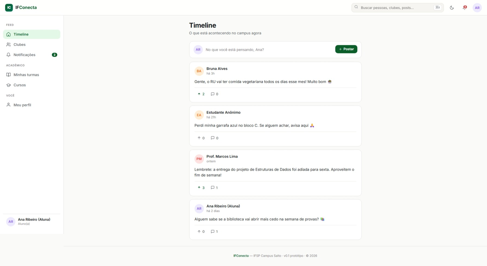
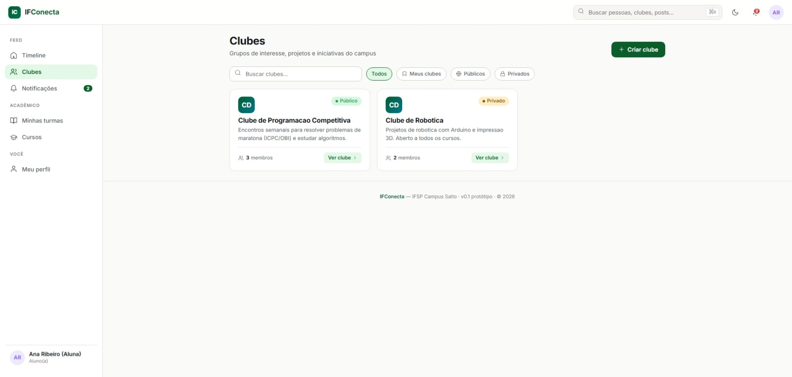
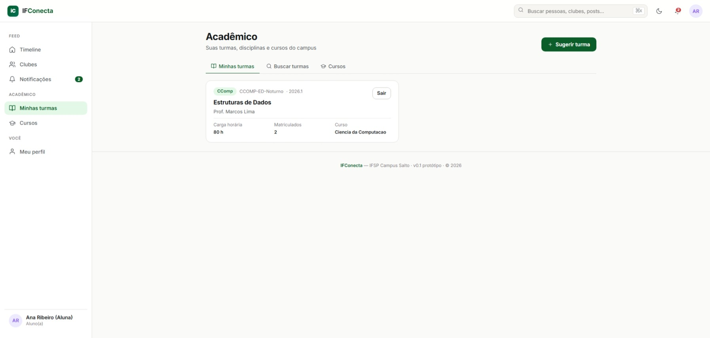
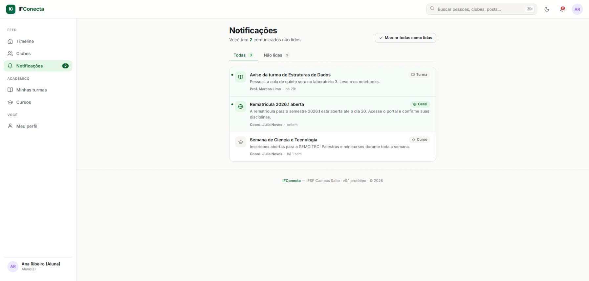

# IFConecta

Plataforma de comunicação acadêmica para o IFSP — uma rede interna onde alunos, professores e setores institucionais conversam em **clubes**, publicam **posts**, organizam **turmas** e recebem **comunicados** oficiais.

O repositório é um monorepo com dois projetos:

- **Backend** (`/`) — API REST em Spring Boot 4 + Java 21, arquitetura hexagonal, PostgreSQL.
- **Frontend** (`ifconecta-web/`) — SPA em React 18 + Vite, consumindo a API.

---

## Sumário

- [Telas](#telas)
- [Stack](#stack)
- [Estrutura do repositório](#estrutura-do-repositório)
- [Pré-requisitos](#pré-requisitos)
- [Como rodar](#como-rodar)
- [Módulos](#módulos)
- [Arquitetura](#arquitetura)
- [Documentação e ferramentas](#documentação-e-ferramentas)

---

## Telas

Interface em React + Vite, na visão de **aluno**, populada com os dados de exemplo do [`scripts/seed_dev.sql`](scripts/seed_dev.sql).

**Login** — em modo de desenvolvimento, exibe atalhos de acesso rápido por papel (Aluno / Professor / Institucional).


| Timeline | Clubes |
|:---:|:---:|
|  |  |
| **Timeline** — feed geral do campus com posts, upvotes, comentários e posts anônimos | **Clubes** — comunidades públicas e privadas, com contagem de membros |
|  |  |
| **Minhas turmas** — disciplinas, turmas e matrículas do aluno | **Notificações** — comunicados segmentados por turma, curso e geral |

---

## Stack

**Backend**
- Java 21, Spring Boot 4.0.5
- Spring Web MVC, Spring Data JPA, Spring Security
- PostgreSQL 15 + Flyway (migrações versionadas)
- JWT stateless (jjwt 0.12.5)
- Lombok, SpringDoc OpenAPI (Swagger UI)

**Frontend**
- React 18 + React Router 6
- Vite 5
- Axios

**Infra local**
- Docker Compose (PostgreSQL + MailHog)

---

## Estrutura do repositório

```
ifconecta/
├── src/                                 # backend Spring Boot
│   ├── main/java/com/henrique/ifconecta/
│   │   ├── domain/<feature>/            # modelos, ports e enums (sem Spring/JPA)
│   │   ├── application/<feature>/       # use cases (@Service) e DTOs de entrada
│   │   └── infrastructure/
│   │       ├── web/<feature>/           # controllers REST + DTOs HTTP
│   │       ├── persistence/<feature>/   # entidades JPA, repositórios, adapters, mappers
│   │       └── config/                  # security, OpenAPI, exception handler
│   └── main/resources/db/migration/     # migrações Flyway V{n}__*.sql
├── ifconecta-web/                       # frontend React/Vite
├── docker-compose.yml                   # Postgres + MailHog
├── IF Conecta - Otimizado.postman_collection.json
└── pom.xml
```

Cada uma das cinco features (`usuario`, `academico`, `clube`, `post`, `notificacao`) aparece nas três camadas — `domain`, `application` e `infrastructure` — sempre na mesma ordem: **Controller → UseCase → Port → Adapter → Repository → Mapper → Entity**.

---

## Pré-requisitos

- JDK 21
- Docker + Docker Compose
- Node.js 18+ e npm (para o frontend)
- Maven Wrapper já incluso (`./mvnw` ou `mvnw.cmd`)

---

## Como rodar

### 1. Suba os serviços de infra

```bash
docker compose up -d
```

Isso levanta:
- **PostgreSQL** em `localhost:5433` (banco `ifconecta`), já alinhado com o `application-local.yml`. As credenciais vêm de `DB_USER`/`DB_PASSWORD` — o Docker Compose lê o `.env` da raiz automaticamente; sem `.env`, o padrão é `ifconecta_admin` / `local_password`.
- **MailHog**: SMTP em `localhost:1025`, interface web em <http://localhost:8025>

### 2. Configure variáveis de ambiente

| Variável | Obrigatória | Descrição |
|---|---|---|
| `JWT_SECRET` | sim | Chave para assinar tokens JWT |
| `DB_USER` | sim | Usuário do PostgreSQL |
| `DB_PASSWORD` | sim | Senha do PostgreSQL |
| `admin.default.email` | não | Email do admin seed inicial |
| `admin.default.password` | não | Senha do admin seed inicial |

No primeiro start, o `AdminSeeder` cria um usuário `Institucional` com papel `ROLE_ADMIN` caso ainda não exista nenhum admin.

### 3. Rode o backend

```bash
./mvnw spring-boot:run        # Linux / macOS / Git Bash
mvnw.cmd spring-boot:run      # Windows PowerShell / CMD
```

A API sobe em <http://localhost:8080>.
Swagger UI: <http://localhost:8080/swagger-ui.html>.

### 4. Rode o frontend

```bash
cd ifconecta-web
npm install
npm run dev
```

Vite serve a SPA em <http://localhost:5173> (ou na próxima porta livre).

### 5. (Opcional) Popule dados de teste

Com o schema já migrado (após o primeiro start do backend), rode o seed de desenvolvimento — cria usuários de cada papel, clubes, posts, turmas e notificações de exemplo. É **idempotente** e **não** é uma migração Flyway (não afeta produção nem as branches acadêmicas):

```bash
docker exec -i ifconecta-db psql -U ifconecta_admin -d ifconecta < scripts/seed_dev.sql
```

> Use o mesmo usuário do seu `.env` (`DB_USER`) no lugar de `ifconecta_admin`, se tiver personalizado.

Contas criadas (senha `senha123`): `dev.aluno@aluno.ifsp.edu.br`, `dev.professor@ifsp.edu.br`, `dev.institucional@ifsp.edu.br`. Em modo de desenvolvimento, a tela de login exibe atalhos de acesso rápido para essas contas.

### Testes

```bash
./mvnw test                                                           # toda a suíte
./mvnw test -Dtest=IfconectaApplicationTests#contextLoads             # um teste
```

---

## Módulos

| Módulo | Responsabilidade |
|---|---|
| **usuario** | Cadastro, autenticação JWT, três subtipos (`Aluno`, `Professor`, `Institucional`), ativação por e-mail, fluxo de convite para professores/institucionais |
| **academico** | Cursos, disciplinas e turmas; aluno solicita criação de turma e professor aprova |
| **clube** | Clubes/comunidades onde alunos se reúnem por interesse |
| **post** | Publicações em clubes ou globais, com sistema de upvote (toggle) e opção anônima |
| **notificacao** | Comunicados emitidos por institucionais/professores com matriz de permissão por papel |

Domínios de e-mail aceitos no cadastro de aluno: `@aluno.ifsp.edu.br` e `@ifsp.edu.br`.

---

## Arquitetura

Hexagonal / ports-and-adapters, organizada **por feature antes da camada**. Regras que o código segue à risca:

- **Modelos de domínio não são entidades JPA.** Cada feature tem `Usuario` (domínio puro) e `UsuarioJpaEntity` (persistência), com um `*Mapper` traduzindo entre os dois.
- **Use cases dependem de ports**, nunca de Spring Data diretamente. Os adapters em `infrastructure/persistence/*/adapter` implementam essas ports.
- **Controllers só traduzem**: request DTO → input do use case → `ResponseEntity`. Validação fica nos DTOs com Jakarta Validation.
- **Schema é controlado pelo Flyway.** `ddl-auto=validate` — qualquer mudança no banco vira uma nova migração `V{n}__*.sql`.
- **Erros de negócio** sobem como `NegocioException` e são traduzidos para `400 {"erro": "..."}` pelo `GlobalExcpetHandler`.

---

## Documentação e ferramentas

- **Swagger UI**: <http://localhost:8080/swagger-ui.html>
- **MailHog**: <http://localhost:8025> (inspecionar e-mails de ativação/convite em dev)
- **Postman**: importe `IF Conecta - Otimizado.postman_collection.json` para uma coleção pronta com os endpoints principais

---

## Status

Em desenvolvimento ativo. Projeto pessoal do autor com uso pedagógico em disciplinas do IFSP — branches `release/versao-apsi` e `release/versao-lp1` mantêm cortes reduzidos do escopo para entrega acadêmica; `main` é o tronco livre.
