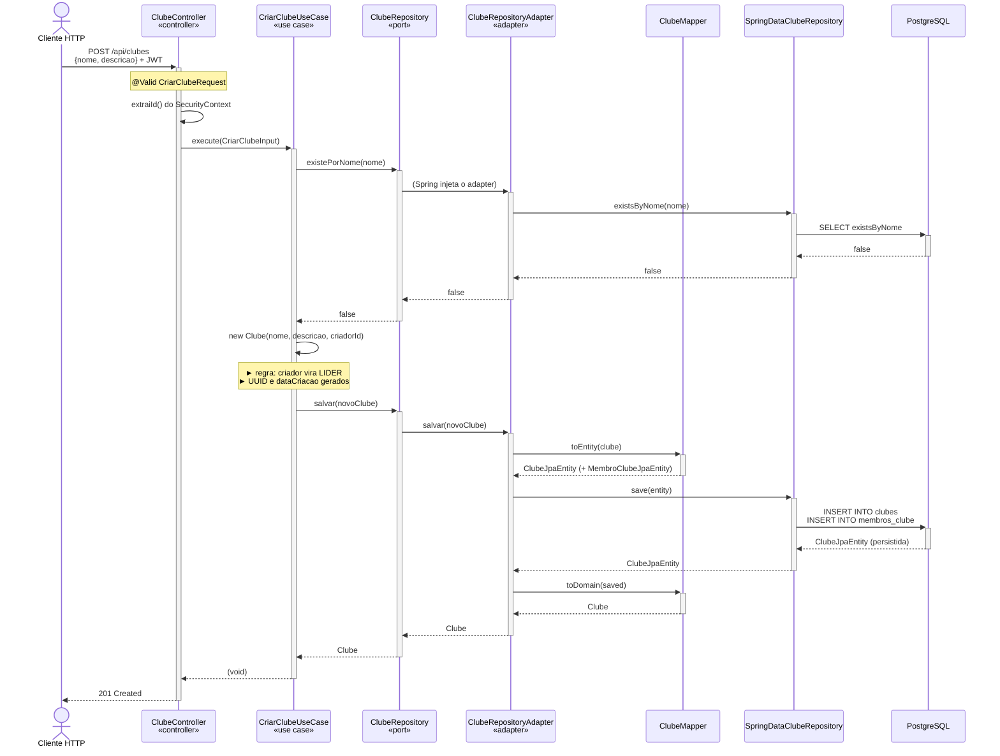
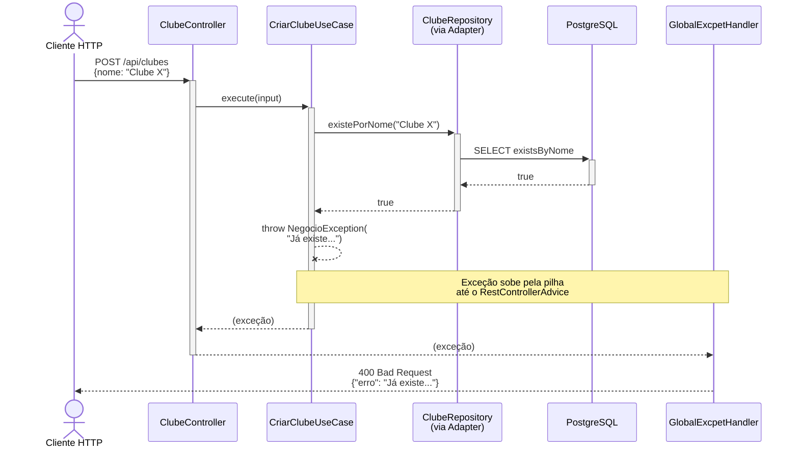
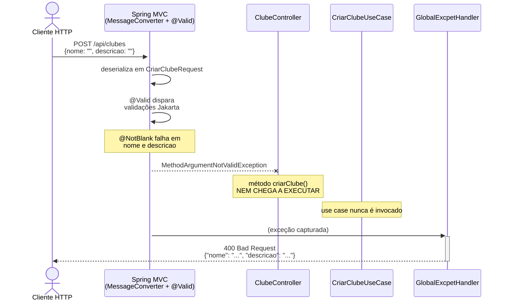

# Código de Referência — Caso de Uso "Criar Clube"

> Entrega de 19/05 — Disciplina: Análise e Projeto de Sistemas
> Branch: `release/versao-apsi`
> História de usuário central: **"Como usuário, quero criar um clube para reunir pessoas em torno de um interesse comum."**

Este documento é o **vertical slice** do caso de uso: percorre o fluxo "Criar Clube" atravessando todas as camadas, mostrando como a Arquitetura Hexagonal descrita em [modelo-arquitetura.md](modelo-arquitetura.md) se manifesta no código real.

---

## 1. Visão geral do fluxo

```
HTTP POST /api/clubes                              [Cliente]
        │
        ▼
ClubeController.criarClube()                       [infrastructure.web]
        │   ► valida @Valid CriarClubeRequest
        │   ► extrai criadorId do SecurityContext
        │   ► monta CriarClubeInput
        ▼
CriarClubeUseCase.execute(input)                   [application]
        │   ► clubeRepository.existePorNome()
        │   ► new Clube(...)        ← regra: criador vira líder
        │   ► clubeRepository.salvar()
        ▼
ClubeRepository (interface)                        [domain.clube.port]
        │   ▲ implementado por
        ▼
ClubeRepositoryAdapter.salvar()                    [infrastructure.persistence]
        │   ► ClubeMapper.toEntity(clube)
        │   ► springDataClubeRepository.save(entity)
        │   ► ClubeMapper.toDomain(saved)
        ▼
SpringDataClubeRepository (Spring Data JPA)
        │
        ▼
PostgreSQL — tabelas `clubes` e `membros_clube`
```

A resposta final é `HTTP 201 Created` (sem corpo).

### Diagrama de sequência (Mermaid) — caminho feliz



> **Por que `ClubeRepository` aparece como participante mesmo sendo apenas uma interface?** Porque didaticamente o diagrama mostra a **direção da dependência**: o `UseCase` chama a **porta** (não o adapter). O Spring é quem resolve a chamada para o `Adapter` em runtime — isso é a "mágica" da inversão de dependência que caracteriza Hexagonal.

---

## 2. Caminho feliz — código por camada

### 2.1 Camada `infrastructure.web` — entrada HTTP

#### [ClubeController.java:47-61](src/main/java/com/henrique/ifconecta/infrastructure/web/clube/controller/ClubeController.java#L47-L61)

```java
@PostMapping
public ResponseEntity<Void> criarClube(@RequestBody @Valid CriarClubeRequest request) {
    // Extraímos o ID do utilizador que o JwtAuthenticationFilter colocou no contexto
    String userIdStr = extraiId();
    UUID criadorId = UUID.fromString(userIdStr);

    CriarClubeInput input = new CriarClubeInput(
            request.nome(),
            request.descricao(),
            criadorId);

    criarClubeUseCase.execute(input);

    return ResponseEntity.status(HttpStatus.CREATED).build();
}
```

**Responsabilidades estritas:**
- (1) deserializar o JSON em `CriarClubeRequest`;
- (2) acionar validações via `@Valid`;
- (3) extrair contexto de segurança (quem é o usuário autenticado);
- (4) montar o `Input` da camada `application`;
- (5) chamar o use case;
- (6) traduzir o resultado em `ResponseEntity`.

O controller **não tem regra de negócio**. Se você encontrar um `if` de domínio aqui, é sinal de vazamento de responsabilidade.

#### [CriarClubeRequest.java:7-13](src/main/java/com/henrique/ifconecta/infrastructure/web/clube/dto/CriarClubeRequest.java#L7-L13)

```java
public record CriarClubeRequest(
        @Schema(description = "Nome único do clube", example = "Clube de Programação Competitiva")
        @NotBlank(message = "O nome do clube é obrigatório.")
        String nome,

        @Schema(description = "Descrição detalhada do objetivo do clube", example = "Grupo focado em resolver problemas do LeetCode e Beecrowd.")
        @NotBlank(message = "A descrição do clube é obrigatória.")
        String descricao
) {}
```

**Por que é um record na camada web e não o `CriarClubeInput` direto?**
- O Request DTO carrega *anotações de framework* (`@Schema` para o Swagger, `@NotBlank` do Jakarta Validation). Se ele fosse o objeto da camada `application`, a regra "este campo é obrigatório no HTTP" iria contaminar o use case.
- A separação permite que o mesmo use case seja invocado a partir de outro adapter (ex.: um job, um teste) sem precisar passar por `@Valid`.

---

### 2.2 Camada `application` — orquestração

#### [CriarClubeUseCase.java:15-32](src/main/java/com/henrique/ifconecta/application/clube/usecase/CriarClubeUseCase.java#L15-L32)

```java
@Service
@RequiredArgsConstructor
public class CriarClubeUseCase {

    private final ClubeRepository clubeRepository;   // ◄ porta (domain), não adapter

    @Transactional
    public void execute(CriarClubeInput input) {
        if (clubeRepository.existePorNome(input.nome())) {
            throw new NegocioException("Já existe um clube registrado com este nome.");
        }

        Clube novoClube = new Clube(
            input.nome(),
            input.descricao(),
            input.criadorId()
        );

        clubeRepository.salvar(novoClube);
    }
}
```

**Pontos arquiteturais a destacar na defesa:**
- O campo `clubeRepository` é do tipo **`ClubeRepository` (interface do `domain.clube.port`)**, não do tipo `ClubeRepositoryAdapter`. O Spring resolve a injeção em runtime. Este é exatamente o "D" do SOLID e o que torna a arquitetura "Hexagonal" no sentido estrito.
- A regra de unicidade ("não pode existir dois clubes com o mesmo nome") é decidida **aqui**, na camada de aplicação, e não no banco — o `UNIQUE` no SQL existe como defesa em profundidade, mas a mensagem amigável vem deste `if`.
- `@Transactional` está aqui (e não no controller nem no adapter) porque o "limite transacional" coincide com o limite de um caso de uso.

#### [CriarClubeInput.java:5-9](src/main/java/com/henrique/ifconecta/application/clube/dto/CriarClubeInput.java#L5-L9)

```java
public record CriarClubeInput(
    String nome,
    String descricao,
    UUID criadorId
) {}
```

Record sem anotações — é o contrato puro da camada `application`. O `criadorId` chega já resolvido (o controller fez `UUID.fromString` no principal do `SecurityContext`), porque o use case **não deve saber que existe um SecurityContext**.

---

### 2.3 Camada `domain` — regras e modelo

#### [Clube.java:21-31](src/main/java/com/henrique/ifconecta/domain/clube/model/Clube.java#L21-L31) — construtor de criação

```java
// Construtor de Criação (um clube nunca nasce vazio, quem cria vira o líder)
public Clube(String nome, String descricao, UUID criadorId) {
    this.id = UUID.randomUUID();
    this.nome = nome;
    this.descricao = descricao;
    this.status = StatusClube.ATIVO;
    this.dataCriacao = LocalDateTime.now();

    this.membros = new ArrayList<>();
    // O criador é líder e aprovado automaticamente
    this.membros.add(new MembroClube(criadorId, PapelMembro.LIDER));
}
```

**Regra de negócio invariante:** *um clube nunca existe sem pelo menos um membro, que é seu líder*. Ela está **dentro do construtor do domínio**, não no use case. Isso é deliberado — qualquer caminho que crie um `Clube` (uma futura UI admin, um import em batch) herda essa garantia automaticamente.

> Note também o **construtor de reconstituição** mais abaixo no arquivo (`Clube(UUID id, ...)`): ele é usado pelo `ClubeMapper` para recriar o objeto a partir do banco, preservando ids e timestamps. É um padrão fixo nesta arquitetura — todo modelo de domínio tem dois construtores: um para criar (atribui `UUID.randomUUID()` e `LocalDateTime.now()`) e outro para reconstituir.

#### [MembroClube.java:15-20](src/main/java/com/henrique/ifconecta/domain/clube/model/MembroClube.java#L15-L20)

```java
// Construtor de Criação
public MembroClube(UUID usuarioId, PapelMembro papel) {
    this.id = UUID.randomUUID();
    this.usuarioId = usuarioId;
    this.papel = papel;
    this.dataIngresso = LocalDateTime.now();
}
```

Note que `MembroClube` guarda `usuarioId: UUID`, e não uma referência ao objeto `Usuario`. Isso reduz o acoplamento entre agregados (`Clube` e `Usuario` evoluem independentemente).

#### [ClubeRepository.java:10-16](src/main/java/com/henrique/ifconecta/domain/clube/port/ClubeRepository.java#L10-L16) — a porta

```java
public interface ClubeRepository {
    Clube salvar(Clube clube);
    Optional<Clube> buscarPorId(UUID id);
    Pagina<Clube> listarTodosAtivos(int pagina, int tamanho);
    boolean existePorNome(String nome);
    List<UUID> buscarIdsMembros(UUID clubeId);
}
```

A porta é uma **interface Java pura**. Nada de `org.springframework.*`, nada de `jakarta.persistence.*`. Os tipos que ela usa (`Clube`, `Pagina`) também são do domínio. Esta é a "borda" do hexágono pelo lado direito (lado de persistência).

---

### 2.4 Camada `infrastructure.persistence` — o adapter

#### [ClubeRepositoryAdapter.java:22-36](src/main/java/com/henrique/ifconecta/infrastructure/persistence/clube/adapter/ClubeRepositoryAdapter.java#L22-L36)

```java
@Component
@RequiredArgsConstructor
public class ClubeRepositoryAdapter implements ClubeRepository {

    private final SpringDataClubeRepository springDataClubeRepository;
    private final ClubeMapper clubeMapper;

    @Override
    public Clube salvar(Clube clube) {
        ClubeJpaEntity entity = clubeMapper.toEntity(clube);

        ClubeJpaEntity savedEntity = springDataClubeRepository.save(entity);

        return clubeMapper.toDomain(savedEntity);
    }
    // ...
}
```

**O que o adapter faz e por que ele existe:**
- Implementa a porta `ClubeRepository` (anotada `@Component` para o Spring registrar).
- *Converte* o objeto de domínio para `ClubeJpaEntity` (via mapper), delega ao Spring Data, e *reconverte* a entidade salva de volta para domínio.
- A dependência do framework (`SpringDataClubeRepository`, `@Component`) está restrita a esta classe. Se amanhã trocarmos JPA por Mongo, criamos um `ClubeRepositoryAdapter` novo e o use case continua intacto.

#### [SpringDataClubeRepository.java:17-24](src/main/java/com/henrique/ifconecta/infrastructure/persistence/clube/repository/SpringDataClubeRepository.java#L17-L24)

```java
@Repository
public interface SpringDataClubeRepository extends JpaRepository<ClubeJpaEntity, UUID> {
    boolean existsByNome(String nome);

    Page<ClubeJpaEntity> findAllByStatus(StatusClube status, Pageable pageable);

    @Query("SELECT m.usuario.id FROM MembroClubeJpaEntity m WHERE m.clube.id = :clubeId")
    List<UUID> findIdsMembrosByClubeId(@Param("clubeId") UUID clubeId);
}
```

Esta interface é **detalhe puro do Spring Data JPA** — por isso vive em `infrastructure.persistence` e nunca é referenciada por `application` ou `domain`.

#### [ClubeMapper.java:22-51](src/main/java/com/henrique/ifconecta/infrastructure/persistence/clube/mapper/ClubeMapper.java#L22-L51) — o tradutor

```java
public ClubeJpaEntity toEntity(Clube domain) {
    ClubeJpaEntity entity = new ClubeJpaEntity();

    entity.setId(domain.getId());
    entity.setNome(domain.getNome());
    entity.setDescricao(domain.getDescricao());
    entity.setStatus(domain.getStatus());
    entity.setDataCriacao(domain.getDataCriacao());

    entity.setMembros(domain.getMembros().stream()
            .map(membro -> toMembroEntity(membro, entity))
            .collect(Collectors.toList()));

    return entity;
}

public MembroClubeJpaEntity toMembroEntity(MembroClube domain, ClubeJpaEntity clubeEntity) {
    MembroClubeJpaEntity entity = new MembroClubeJpaEntity();

    entity.setId(domain.getId());
    entity.setClube(clubeEntity);
    entity.setPapel(domain.getPapel());
    entity.setDataIngresso(domain.getDataIngresso());

    // Obtemos uma referência "proxy" do utilizador pelo ID para não fazer SELECT desnecessário
    entity.setUsuario(entityManager.getReference(UsuarioJpaEntity.class, domain.getUsuarioId()));

    return entity;
}
```

**Truque importante de Hexagonal aplicado aqui:** `entityManager.getReference(...)` cria um proxy do `UsuarioJpaEntity` apenas com o id, sem consultar o banco. Isso permite que o domínio trabalhe apenas com `UUID usuarioId` (sem acoplamento) e que a persistência ainda gere o `FK usuario_id` corretamente.

#### [ClubeJpaEntity.java:21-44](src/main/java/com/henrique/ifconecta/infrastructure/persistence/clube/entity/ClubeJpaEntity.java#L21-L44)

```java
@Entity
@Table(name = "clubes")
@Getter
@Setter
public class ClubeJpaEntity {
    @Id
    private UUID id;

    @Column(nullable = false)
    private String nome;

    @Column(nullable = false, columnDefinition = "TEXT")
    private String descricao;

    @Enumerated(EnumType.STRING)
    @Column(nullable = false)
    private StatusClube status;

    @Column(name = "data_criacao", nullable = false, updatable = false)
    private LocalDateTime dataCriacao;

    @OneToMany(mappedBy = "clube", cascade = CascadeType.ALL, orphanRemoval = true)
    private List<MembroClubeJpaEntity> membros = new ArrayList<>();
}
```

A entidade JPA é **anêmica de propósito** (só getters/setters via Lombok): toda a regra está em `Clube` (o modelo de domínio). Aqui vivem apenas as anotações de mapeamento O/R.

---

## 3. Caminhos de erro

A regra do projeto é: **erros de negócio são `NegocioException`** e o tratamento global as transforma em `400 Bad Request` com um JSON `{"erro": "..."}`. Erros de validação de campo viram `400` com `{"campo": "mensagem"}`.

### 3.1 Erro de regra de negócio — nome de clube duplicado

#### Origem: o `if` no use case ([CriarClubeUseCase.java:21-23](src/main/java/com/henrique/ifconecta/application/clube/usecase/CriarClubeUseCase.java#L21-L23))

```java
if (clubeRepository.existePorNome(input.nome())) {
    throw new NegocioException("Já existe um clube registrado com este nome.");
}
```

#### Tipo do erro: [NegocioException.java](src/main/java/com/henrique/ifconecta/domain/usuario/exception/NegocioException.java)

```java
public class NegocioException extends RuntimeException {
    public NegocioException(String message) {
        super(message);
    }
}
```

> A classe vive em `domain.usuario.exception` por razões históricas (foi a primeira feature). É reutilizada por todas as features e seria mais correta em `domain.shared.exception` — fica como dívida técnica conhecida. Para a apresentação, basta citar.

#### Tratamento global: [GlobalExcpetHandler.java:18-23](src/main/java/com/henrique/ifconecta/infrastructure/config/excpetion/GlobalExcpetHandler.java#L18-L23)

```java
// Trata erros de negócio
@ExceptionHandler(NegocioException.class)
public ResponseEntity<Map<String, String>> handleNegocioException(NegocioException ex) {
    Map<String, String> response = new HashMap<>();
    response.put("erro", ex.getMessage());
    return ResponseEntity.status(HttpStatus.BAD_REQUEST).body(response);
}
```

**Resultado para o cliente HTTP:**

```http
HTTP/1.1 400 Bad Request
Content-Type: application/json

{ "erro": "Já existe um clube registrado com este nome." }
```

> Note o nome com typo da classe: `GlobalExcpetHandler` (e do pacote `infrastructure.config.excpetion`). É proposital manter como está nesta entrega — renomear é mudança transversal que será feita em outra branch.

#### Diagrama de sequência (Mermaid) — nome duplicado



### 3.2 Erro de validação — `nome` ou `descricao` em branco

#### Origem: anotação no DTO + `@Valid` no controller

A validação dispara automaticamente quando o JSON da requisição não satisfaz as restrições de [CriarClubeRequest.java:7-13](src/main/java/com/henrique/ifconecta/infrastructure/web/clube/dto/CriarClubeRequest.java#L7-L13). O Spring lança `MethodArgumentNotValidException` *antes* mesmo de o método `criarClube` executar.

#### Tratamento global: [GlobalExcpetHandler.java:26-33](src/main/java/com/henrique/ifconecta/infrastructure/config/excpetion/GlobalExcpetHandler.java#L26-L33)

```java
// Trata erros de @Valid do Controller
@ExceptionHandler(MethodArgumentNotValidException.class)
public ResponseEntity<Map<String, String>> handleValidationExceptions(MethodArgumentNotValidException ex) {
    Map<String, String> errors = new HashMap<>();
    ex.getBindingResult().getFieldErrors().forEach(error ->
        errors.put(error.getField(), error.getDefaultMessage())
    );
    return ResponseEntity.status(HttpStatus.BAD_REQUEST).body(errors);
}
```

**Resultado para o cliente HTTP** (exemplo: ambos os campos em branco):

```http
HTTP/1.1 400 Bad Request
Content-Type: application/json

{
  "nome": "O nome do clube é obrigatório.",
  "descricao": "A descrição do clube é obrigatória."
}
```

#### Diagrama de sequência (Mermaid) — `@Valid` falhou



> **Ponto-chave para a defesa:** repare que neste caminho o método `criarClube` **não chega nem a executar**. O Spring valida o request *antes* de invocar o controller, o que mantém a regra "use case nunca recebe input inválido". Isso é uma propriedade arquitetural importante: validação de formato fica no DTO da camada `web`; validação de regra de negócio fica no use case.

---

## 4. Quadro-resumo do vertical slice

| # | Camada | Arquivo | Papel |
|---|---|---|---|
| 1 | `infrastructure.web` | [ClubeController.java](src/main/java/com/henrique/ifconecta/infrastructure/web/clube/controller/ClubeController.java) | recebe HTTP, monta input, chama use case |
| 2 | `infrastructure.web` | [CriarClubeRequest.java](src/main/java/com/henrique/ifconecta/infrastructure/web/clube/dto/CriarClubeRequest.java) | DTO HTTP com `@NotBlank` e `@Schema` |
| 3 | `application` | [CriarClubeUseCase.java](src/main/java/com/henrique/ifconecta/application/clube/usecase/CriarClubeUseCase.java) | orquestra; valida unicidade; constrói e persiste o `Clube` |
| 4 | `application` | [CriarClubeInput.java](src/main/java/com/henrique/ifconecta/application/clube/dto/CriarClubeInput.java) | record de entrada do use case |
| 5 | `domain` | [Clube.java](src/main/java/com/henrique/ifconecta/domain/clube/model/Clube.java) | modelo de domínio; regra "criador vira líder" no construtor |
| 6 | `domain` | [MembroClube.java](src/main/java/com/henrique/ifconecta/domain/clube/model/MembroClube.java) | modelo de domínio; guarda `usuarioId: UUID` |
| 7 | `domain` | [StatusClube.java](src/main/java/com/henrique/ifconecta/domain/clube/enums/StatusClube.java), [PapelMembro.java](src/main/java/com/henrique/ifconecta/domain/clube/enums/PapelMembro.java) | enums de domínio |
| 8 | `domain` | [ClubeRepository.java](src/main/java/com/henrique/ifconecta/domain/clube/port/ClubeRepository.java) | **porta** — interface implementada por adapter |
| 9 | `domain` | [NegocioException.java](src/main/java/com/henrique/ifconecta/domain/usuario/exception/NegocioException.java) | exceção de regra de negócio |
| 10 | `infrastructure.persistence` | [ClubeRepositoryAdapter.java](src/main/java/com/henrique/ifconecta/infrastructure/persistence/clube/adapter/ClubeRepositoryAdapter.java) | **adapter** — implementa a porta usando Spring Data |
| 11 | `infrastructure.persistence` | [SpringDataClubeRepository.java](src/main/java/com/henrique/ifconecta/infrastructure/persistence/clube/repository/SpringDataClubeRepository.java) | repositório Spring Data JPA |
| 12 | `infrastructure.persistence` | [ClubeMapper.java](src/main/java/com/henrique/ifconecta/infrastructure/persistence/clube/mapper/ClubeMapper.java) | converte domínio ↔ entidade JPA |
| 13 | `infrastructure.persistence` | [ClubeJpaEntity.java](src/main/java/com/henrique/ifconecta/infrastructure/persistence/clube/entity/ClubeJpaEntity.java), [MembroClubeJpaEntity.java](src/main/java/com/henrique/ifconecta/infrastructure/persistence/clube/entity/MembroClubeJpaEntity.java) | entidades JPA |
| 14 | `infrastructure.config` | [GlobalExcpetHandler.java](src/main/java/com/henrique/ifconecta/infrastructure/config/excpetion/GlobalExcpetHandler.java) | traduz `NegocioException` e `MethodArgumentNotValidException` em 400 |

---

## 5. O que destacar na apresentação

1. **Mostrar a interface `ClubeRepository` (porta) ao lado do `ClubeRepositoryAdapter` (adapter).** É a prova visual de que o estilo é Hexagonal de fato.
2. **Mostrar que o use case depende da porta, não do adapter.** Apontar para o campo `private final ClubeRepository clubeRepository;` em `CriarClubeUseCase`.
3. **Mostrar a regra no construtor do `Clube`** (`this.membros.add(new MembroClube(criadorId, PapelMembro.LIDER))`). É um exemplo de regra invariante que vive no domínio, e não no use case.
4. **Mostrar o `ClubeMapper`** como a fronteira de tradução entre dois mundos: o de objetos ricos (domínio) e o de objetos anêmicos (JPA).
5. **Mostrar o `GlobalExcpetHandler`** como o ponto único que define a "linguagem de erro" da API — todas as exceções de negócio caem ali.
