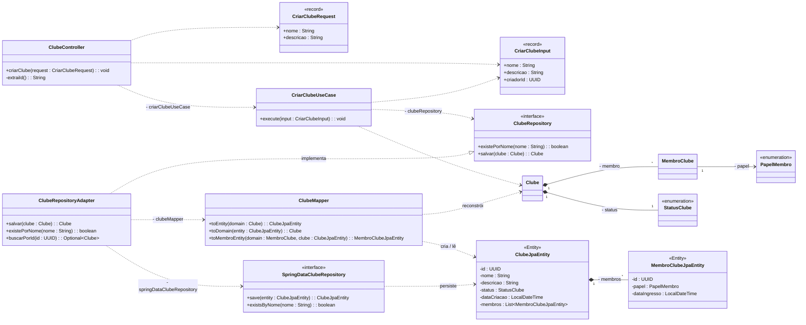
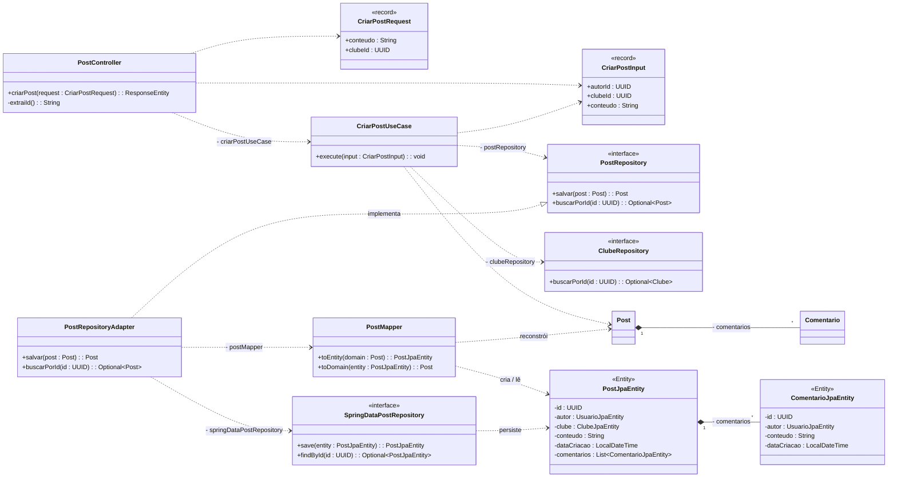
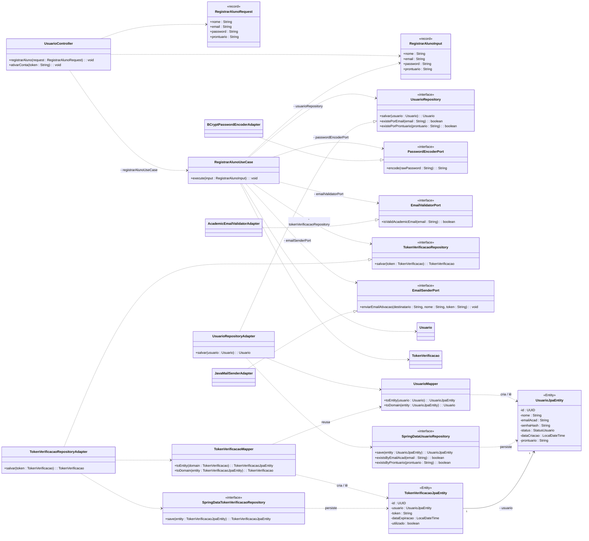
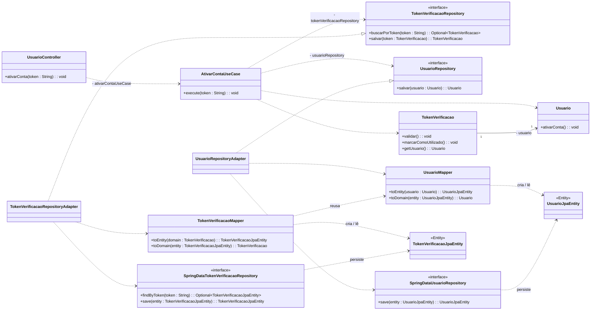
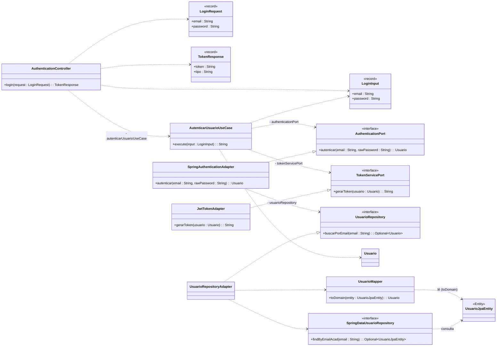

# Fluxos de casos de uso com conversão e JPA Entity

Diagramas dos fluxos **CriarClube** e **CriarPost** acrescentando o passo de conversão
domínio ↔ entidade (`Mapper`) e as classes `JpaEntity`. As assinaturas de métodos e os
campos refletem o código atual.

## Fluxo 1 — CriarClube

## Fluxo 2 — CriarPost

## Fluxo 3 — RegistrarAluno

## Fluxo 4 — AtivarConta

## Fluxo 5 — AutenticarUsuario (Login)

> **Login não persiste:** o fluxo apenas *lê* o usuário (`buscarPorEmail` → `UsuarioMapper.toDomain`), valida senha/status e gera o JWT. Por isso só aparece o `toDomain` — não há `toEntity` nem `save`.

## Notas para o Astah

As caixas/relações marcadas com `NOVO` são as que precisam ser adicionadas; o restante já
existe nos diagramas originais.

- Adicione o **Adapter** (`ClubeRepositoryAdapter` / `PostRepositoryAdapter`) e ligue-o ao
  **port** com uma realização (linha tracejada com triângulo, `..|>` "implementa"). É o
  adapter — não o port — que orquestra a conversão.
- Adicione o **SpringDataRepository** (`SpringDataClubeRepository` / `SpringDataPostRepository`)
  com estereótipo `<<interface>>`; é a quem o adapter delega o `save`/`findById`.
- Adicione a classe **Mapper** (`ClubeMapper` / `PostMapper`) com `toEntity` e `toDomain` —
  é onde ocorre a conversão domínio → entidade.
- Adicione a **JpaEntity** (`ClubeJpaEntity` / `PostJpaEntity`) com estereótipo `<<Entity>>`.
- Adicione a entidade-filha em composição: `MembroClubeJpaEntity` / `ComentarioJpaEntity`.
- Fluxo das dependências novas: **Adapter → Mapper** e **Adapter → SpringDataRepository**;
  **Mapper → JpaEntity** ("cria/lê") e **SpringDataRepository → JpaEntity** ("persiste").
  A seta `Mapper → Clube/Post` representa o `toDomain` reconstruindo o domínio.
- O `PostJpaEntity` referencia `UsuarioJpaEntity` e `ClubeJpaEntity` via `@ManyToOne`
  (autor e clube); aqui ficam como atributos para não poluir o diagrama.
