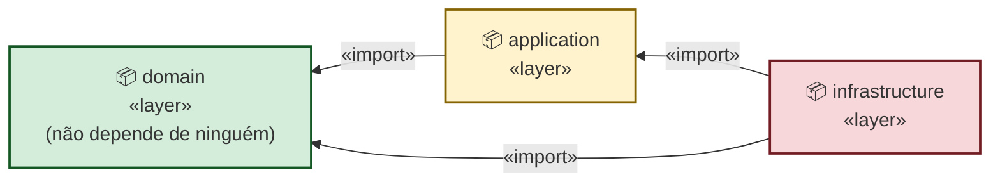
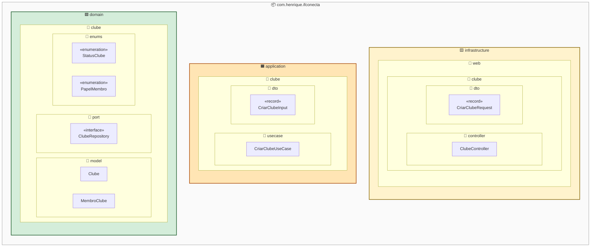
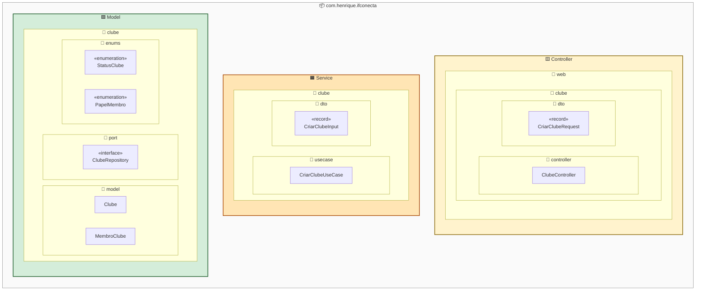

# Modelo de Arquitetura — IFConecta (escopo APSI)

> Entrega de 19/05 — Disciplina: Análise e Projeto de Sistemas
> Branch: `release/versao-apsi`
> Escopo reduzido: módulos **usuario**, **clube** e **post**.

---

## 1. Estilo arquitetural adotado

**Arquitetura Hexagonal (Ports & Adapters)**, organizada *por feature primeiro, por camada depois*.

### Por quê este estilo

- **Isolar a regra de negócio do framework.** O `domain` é Java puro: não conhece Spring, JPA, HTTP, banco. Isso permite que as regras (ex.: "o criador do clube vira líder automaticamente") sejam testadas e revisadas sem subir contexto Spring.
- **Trocar adaptadores sem reescrever regra.** A persistência hoje é PostgreSQL via JPA; trocar por outra implementação (Mongo, in-memory de testes) significa apenas escrever um novo `*RepositoryAdapter` que implemente o `*Repository` (porta). Nenhum *use case* muda.
- **Direção das dependências sempre apontando para dentro.** Esta é a propriedade que caracteriza Hexagonal: `infrastructure → application → domain`. Nunca o contrário. Isso impede que detalhes de framework "vazem" para o miolo do sistema.

### Camadas

| Camada | Responsabilidade | Pode depender de |
|---|---|---|
| `domain` | Modelos de negócio, portas (interfaces), regras invariantes | nada além de `java.*` e `domain.shared` |
| `application` | Orquestração de casos de uso, DTOs de entrada/saída | `domain` |
| `infrastructure` | Adaptadores: web (controllers), persistência (JPA), segurança, e-mail, OpenAPI | `application`, `domain` e frameworks externos |

---

## 2. Diagrama de Pacotes — Visão Macro (3 camadas)

Esta é a **primeira folha** do diagrama no Astah. Apresenta o esqueleto da Arquitetura Hexagonal.

### Pacotes a desenhar

| Pacote | Estereótipo sugerido |
|---|---|
| `com.henrique.ifconecta.domain` | `<<layer>>` |
| `com.henrique.ifconecta.application` | `<<layer>>` |
| `com.henrique.ifconecta.infrastructure` | `<<layer>>` |

### Dependências (setas `<<import>>`)

```
infrastructure  ──────►  application  ──────►  domain
       │                                          ▲
       └──────────────────────────────────────────┘
```

- `application` → `domain` (use cases dependem de modelos e portas)
- `infrastructure` → `application` (controllers chamam use cases)
- `infrastructure` → `domain` (adapters implementam portas; controllers usam `Pagina`, `NegocioException`)

> **Não desenhe seta saindo de `domain`.** O domínio não conhece ninguém. Esta é a regra de ouro da arquitetura — destacar isso na defesa rende ponto.

### Visualização (Mermaid)



---

## 3. Diagrama de Pacotes — Visão Detalhada (caso de uso "Criar Clube")

Esta é a **segunda folha** do diagrama no Astah. A intenção é simples: pegar as classes do **Modelo de Objetos do Caso de Uso "Criar Clube"** (entrega de 12/05) e mostrar **em que pacote cada uma vive** e **como os pacotes se aninham**. Não há setas entre classes — essas já estão no Modelo de Objetos. Esta folha é puramente *organizacional*.

### Visualização 1 — Pacotes com nomes reais do código (Hexagonal)



### Visualização 2 — Mesmos pacotes com rótulos MVC + Service (para apresentação)

Idêntica à Visualização 1, com as 3 camadas-raiz renomeadas para o vocabulário **MVC estendido com Service** (padrão de fato no Spring/JEE). **Os subpacotes mantêm os nomes reais do código** (`web`, `clube`, `controller`, `usecase`, `model`, `port`, `enums`) — só as 3 caixas externas mudam.



### Mapeamento Hexagonal ↔ MVC + Service

| Pacote real (Hexagonal) | Rótulo MVC + Service | Justificativa |
|---|---|---|
| `infrastructure` | **Controller** 🟨 | É onde mora o `ClubeController`, anotado com `@RestController`. Recebe HTTP, valida `@Valid`, extrai contexto de segurança e delega ao service. Casa 1:1 com o "Controller" do MVC. |
| `application` | **Service** 🟧 | É onde mora o `CriarClubeUseCase` — funcionalmente equivalente a um `@Service` do Spring: orquestra o caso de uso, é `@Transactional`, depende de repositório. Camada de regras de **aplicação** (não de domínio). |
| `domain` | **Model** 🟩 | Contém os **dados e as regras invariantes** do negócio: `Clube`, `MembroClube`, enums e a porta `ClubeRepository`. Equivale ao "Model" do MVC (entidades + regras de domínio). |

> **Ressalva academica honesta:** o "MVC puro" do livro tem só 3 papéis (Model/View/Controller) e não tem "Service". O `MVC + Service` (também chamado *3-tier*) é a extensão pragmática que **todo curso de JEE/Spring ensina** — é o padrão de fato do framework. Se o professor questionar, defenda: *"estendemos MVC com a camada de Service, padrão consagrado em Spring/JEE, exatamente como o exemplo do SVSA que tem os pacotes `controller`, `service`, `dao` e `modelo`."*

> **E a View?** Neste recorte (backend isolado) **não há camada de View**: a "apresentação" é feita pelo frontend, que consome a API REST exposta pelo `Controller`. Se o professor perguntar, é exatamente esta a resposta.

> **Dica para a apresentação:** use a Visualização 2 nos slides para o professor; mantenha a Visualização 1 no anexo técnico. Se ele perguntar sobre os nomes reais dos pacotes do código, você abre o anexo e mostra que é a mesma estrutura — só o rótulo da camada raiz mudou.

### Onde mora cada classe do Modelo de Objetos

| Classe | Pacote completo | Estereótipo |
|---|---|---|
| `ClubeController` | `infrastructure.web.clube.controller` | — |
| `CriarClubeRequest` | `infrastructure.web.clube.dto` | `«record»` |
| `CriarClubeUseCase` | `application.clube.usecase` | — |
| `CriarClubeInput` | `application.clube.dto` | `«record»` |
| `ClubeRepository` | `domain.clube.port` | `«interface»` |
| `Clube` | `domain.clube.model` | — |
| `MembroClube` | `domain.clube.model` | — |
| `StatusClube` | `domain.clube.enums` | `«enumeration»` |
| `PapelMembro` | `domain.clube.enums` | `«enumeration»` |

### Hierarquia de pacotes (do raiz às folhas)

```
com.henrique.ifconecta
├── infrastructure          🟨
│   └── web
│       └── clube
│           ├── controller   → ClubeController
│           └── dto          → CriarClubeRequest
├── application             🟧
│   └── clube
│       ├── usecase          → CriarClubeUseCase
│       └── dto              → CriarClubeInput
└── domain                  🟩
    └── clube
        ├── model            → Clube, MembroClube
        ├── port             → ClubeRepository
        └── enums            → StatusClube, PapelMembro
```

### Observações para a defesa

- **Por feature primeiro, por camada depois.** Note que o subpacote `clube` aparece dentro de `infrastructure.web`, de `application` e de `domain`. Não é repetição: é a marca de que toda a feature "clube" pode ser encontrada navegando ao mesmo nome em camadas diferentes. Os módulos `usuario` e `post` seguem exatamente o mesmo padrão.
- **As 3 cores correspondem às 3 camadas** da Visão Macro (seção 2). O verde é o núcleo (`domain`), que não conhece nem `application` nem `infrastructure`.
- **`ClubeRepository` é uma `«interface»`** — fica em `domain.clube.port` porque é a *porta* que o use case usa. A implementação concreta (o "adapter") existe no código (`infrastructure.persistence.clube.adapter`), mas **não foi modelada** no diagrama de classes do caso de uso, então também não aparece aqui. Se o professor perguntar, é o ponto a mencionar.

---

## 4. Roteiro para construir no Astah

### Folha 1 — `Visao-Macro`

1. **Crie uma "Package Diagram"** chamada `Visao-Macro`.
2. Desenhe 3 pacotes: `domain`, `application`, `infrastructure`.
3. Adicione as 3 setas `<<import>>` da seção 2.
4. Adicione uma nota textual: *"o domínio não depende de ninguém — as setas sempre apontam para `domain`"*.

### Folha 2 — `Visao-Clube-Detalhada` (estilo da seção 3)

1. **Crie outra "Package Diagram"** chamada `Visao-Clube-Detalhada`.
2. **Comece pelo pacote raiz** `com.henrique.ifconecta` (caixa grande, sem cor).
3. **Aninhe os 3 pacotes de camada** dentro do raiz (use `Nested Package` no Astah):
   - 🟨 amarelo: `infrastructure`
   - 🟧 laranja: `application`
   - 🟩 verde: `domain`
4. **Dentro de cada camada, aninhe a hierarquia** até as folhas seguindo a tabela "Hierarquia de pacotes":
   - `infrastructure` → `web` → `clube` → `controller` e `dto`
   - `application` → `clube` → `usecase` e `dto`
   - `domain` → `clube` → `model`, `port` e `enums`
5. **Dentro de cada pacote-folha, adicione as classes** correspondentes da tabela "Onde mora cada classe", com o estereótipo apropriado (`«record»`, `«interface»`, `«enumeration»`).
6. **Não desenhe setas entre classes nem entre pacotes.** Esta folha é só de organização — as dependências entre classes já estão no Modelo de Objetos do Caso de Uso (entrega de 12/05).
7. **(Opcional)** Adicione uma nota textual destacando: *"organização por feature primeiro (clube), por camada depois (controller/usecase/model)"*.

---

## 5. Justificativa resumida (para a apresentação)

> Adotamos Arquitetura Hexagonal porque o IFConecta tem mais de um tipo de adaptador externo (HTTP, banco, e-mail, segurança JWT) e a regra de negócio precisa permanecer estável independentemente de qualquer um deles. A organização *por feature primeiro* (`clube`, `post`, `usuario`) facilita encontrar todo o código de uma funcionalidade e mantém a coesão alta; a divisão *por camada dentro de cada feature* (`domain/application/infrastructure`) garante o acoplamento baixo exigido por Hexagonal. O resultado é um sistema em que, por exemplo, trocar JPA por outra tecnologia de persistência exige apenas reescrever os adapters de `infrastructure.persistence`, sem tocar em nenhum use case ou modelo de domínio.
