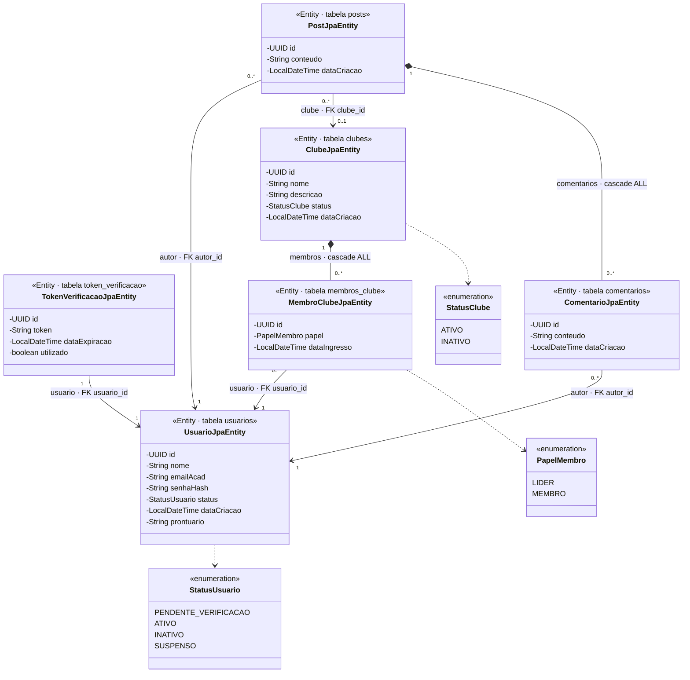
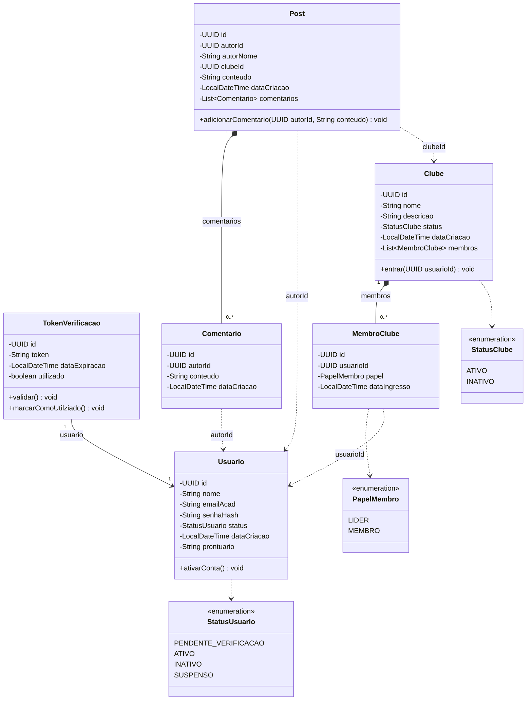

# IFConecta — Modelo de Classes do Sistema (versão APSI)

Este documento apresenta o **Modelo de Classes** do backend do IFConecta em **duas visões complementares**, porque a arquitetura é **hexagonal (Ports & Adapters)** e nela existem, de propósito, duas famílias de classes que modelam o mesmo conceito:

1. **Modelo de Classes — Entidades JPA** (camada de **persistência**): as classes `*JpaEntity` que o Hibernate mapeia para tabelas. **É o diagrama que o professor pediu.**
2. **Modelo de Classes — Domínio** (camada de **negócio**): as classes puras de `domain.*.model`, onde moram os atributos e o **comportamento** (as regras de negócio).

> Os diagramas são escritos em [Mermaid](https://mermaid.js.org/) e renderizam direto no GitHub e no preview do VS Code.

> **Escopo desta versão (APSI):** o modelo está propositalmente **enxuto**, refletindo o que existe no código desta branch — as features `usuario`, `clube` e `post`. A versão LP1 (mais ampla, com `notificacao`, herança de usuário, upvotes etc.) está documentada à parte em [../diagramas.md](../diagramas.md).

---

## Por que dois diagramas (e não um só)?

Numa aplicação OO "tradicional", a classe que tem os dados é a mesma que é gravada no banco. Na **arquitetura hexagonal** isso é separado de propósito:

| | Entidade JPA (`*JpaEntity`) | Modelo de Domínio (`domain.model`) |
|---|---|---|
| **Pacote** | `infrastructure.persistence.*.entity` | `domain.*.model` |
| **Responsabilidade** | Espelhar a **tabela** e suas chaves estrangeiras | Representar o **conceito de negócio** e suas **regras** |
| **Anotações** | `@Entity`, `@Table`, `@ManyToOne`, `@OneToMany`... | Nenhuma — Java puro, sem framework |
| **Comportamento** | **Anêmica** — só dados + *getters/setters* (Lombok) | **Rica** — métodos como `ativarConta()`, `validar()`, `entrar()` |
| **Como referencia outras classes** | Por **objeto** (`UsuarioJpaEntity autor`) + FK no banco | Por **ID** (`UUID autorId`) entre features diferentes |

A ponte entre as duas é feita por um **Mapper** (`infrastructure.persistence.*.mapper`), que traduz `JpaEntity ⇄ Domínio` na entrada/saída do banco. Por isso vale documentar as duas: a JPA mostra **como os dados são guardados**; o domínio mostra **o que o sistema faz com eles**.

---

## Legenda das relações (qual seta usar)

Esta é a parte que costuma gerar dúvida. Em UML, a **seta indica o tipo de relação** — e cada tipo tem um significado preciso:

| Notação Mermaid | Notação UML | Quando usar |
|---|---|---|
| `A <\|-- B` | Triângulo vazado | **Generalização / herança** — "B **é um** A". *(Não usado nesta versão: o `Usuario` do APSI é uma classe única, sem subtipos.)* |
| `A *-- B` | Losango **preenchido** (no lado A) | **Composição** — A é dono de B; **B não existe sem A** e morre junto com ele. |
| `A o-- B` | Losango **vazado** (no lado A) | **Agregação** — A agrupa B, mas **B vive sem A**. *(Não usado aqui.)* |
| `A --> B` | Seta sólida | **Associação** — A **tem uma referência** (um objeto) de B e navega até ele. |
| `A ..> B` | Seta **tracejada** | **Dependência** — A **usa** B de forma fraca: como tipo de um enum, ou referência **por ID (UUID)**, não por objeto. |
| `A ..\|> I` | Tracejada + triângulo | **Realização** — A implementa a interface/*port* I. |

### Regra prática para escolher

1. **É herança?** ("B é um tipo de A") → `<\|--`. *Aqui não há.*
2. **É relação todo–parte?** A "contém" B?
   - Se **apagar A apaga B** (no JPA: `cascade = ALL` + `orphanRemoval = true`) → **composição** `*--`.
   - Se B sobrevive sozinho → **agregação** `o--`. *(Não ocorre neste modelo.)*
3. **A guarda o objeto inteiro de B** e navega até ele? → **associação** `-->`.
4. **A só conhece o ID de B**, ou usa B como **enum**? → **dependência** `..>`.

> **A diferença mais importante deste projeto:** no **domínio**, features diferentes se referenciam **por UUID** (ex.: `Post.autorId`) para reduzir acoplamento entre agregados → por isso são **dependências** (tracejadas). Já no **JPA**, essas mesmas relações viram **chaves estrangeiras reais**, com o objeto carregado por referência → por isso viram **associações** (sólidas) ou **composições**.

---

## 1. Modelo de Classes — Entidades JPA  *(o pedido pelo professor)*

As classes `*JpaEntity` mapeiam **1:1** com as tabelas do banco. São **anêmicas**: têm só os campos (colunas) e as relações; o comportamento fica no domínio. Cada relação aqui corresponde a uma **chave estrangeira** real; `cascade = ALL` + `orphanRemoval = true` caracterizam **composição**.



### Tabela-resumo das relações JPA

| Origem | Destino | Anotação | Tipo de seta | Cardinalidade | FK / `mappedBy` | Cascade / Orphan |
|---|---|---|---|---|---|---|
| `TokenVerificacaoJpaEntity` | `UsuarioJpaEntity` | `@OneToOne` | Associação `-->` | 1 → 1 | `usuario_id` | — |
| `ClubeJpaEntity` | `MembroClubeJpaEntity` | `@OneToMany` | **Composição** `*--` | 1 → 0..* | `mappedBy = "clube"` | **ALL + orphanRemoval** |
| `MembroClubeJpaEntity` | `UsuarioJpaEntity` | `@ManyToOne` | Associação `-->` | 0..* → 1 | `usuario_id` | — |
| `PostJpaEntity` | `UsuarioJpaEntity` | `@ManyToOne` | Associação `-->` | 0..* → 1 | `autor_id` | — |
| `PostJpaEntity` | `ClubeJpaEntity` | `@ManyToOne` | Associação `-->` | 0..* → 0..1 | `clube_id` *(nullable)* | — |
| `PostJpaEntity` | `ComentarioJpaEntity` | `@OneToMany` | **Composição** `*--` | 1 → 0..* | `mappedBy = "post"` | **ALL + orphanRemoval** |
| `ComentarioJpaEntity` | `UsuarioJpaEntity` | `@ManyToOne` | Associação `-->` | 0..* → 1 | `autor_id` | — |

### Pontos a destacar

- **As `*JpaEntity` não têm métodos de negócio.** Diferente do diagrama que você tinha (que mostrava `ativarConta()`, `validar()`, `adicionarComentario()` dentro das entidades JPA), no código esses comportamentos vivem **só no domínio**. As entidades JPA têm apenas *getters/setters* gerados pelo Lombok.
- **Composição vs. associação está nas anotações.** `Clube → Membro` e `Post → Comentário` usam `cascade = ALL` + `orphanRemoval = true`: apagar o todo apaga as partes → **losango preenchido** (`*--`). As demais (`@ManyToOne`/`@OneToOne`) são só referências por FK → **seta sólida** (`-->`).
- **`Post.clube` é opcional (`0..1`).** A FK `clube_id` é *nullable*: um post pode ser da timeline geral (sem clube) ou de um clube específico.
- **`UsuarioJpaEntity` é a entidade "raiz".** Ela não declara relações de saída; quem aponta para ela são `Token`, `Membro`, `Post` e `Comentário` (todas via FK).

---

## 2. Modelo de Classes — Domínio  *(as regras de negócio)*

As classes de `domain.*.model` são **Java puro** (sem `@Entity`). Aqui ficam as **regras**: `Usuario.ativarConta()`, `TokenVerificacao.validar()`, `Clube.entrar()`, `Post.adicionarComentario()`. Note que entre features diferentes a referência é **por UUID** (não por objeto) — por isso aparecem como **dependências tracejadas**.



### Pontos a destacar

- **As regras moram no domínio.** O objeto não é "burro": `Usuario.ativarConta()` muda o status de `PENDENTE_VERIFICACAO` para `ATIVO`; `TokenVerificacao.validar()` recusa token expirado ou já usado; `Clube.entrar()` impede o mesmo usuário de entrar duas vezes; `Post`/`Comentario` recusam conteúdo vazio. Quando uma regra é violada, lançam **`NegocioException`**.
- **Composição (objeto dentro de objeto):** `Clube` **contém** sua `List<MembroClube>` e `Post` **contém** sua `List<Comentario>` → **losango preenchido** (`*--`). É a única relação em que uma feature guarda o **objeto inteiro** de outra parte do seu agregado.
- **`TokenVerificacao` guarda o `Usuario` por objeto** (associação `-->`), porque os dois pertencem à mesma feature `usuario`.
- **Acoplamento por ID entre features:** `MembroClube.usuarioId`, `Post.autorId`, `Post.clubeId` e `Comentario.autorId` são **UUID**, não objetos — uma decisão de design para **reduzir o acoplamento** entre agregados. Por isso são **dependências tracejadas** (`..>`), e não associações.
- **`Post.autorNome` é desnormalizado:** o domínio guarda uma cópia do nome do autor (além do `autorId`) para exibir o post sem precisar carregar o usuário.

---

## Como as duas visões se conectam

A mesma informação atravessa as camadas assim:

```
Controller  →  UseCase  →  Domínio (Usuario, Clube, Post...)  →  Port  →  Adapter  →  Mapper  →  *JpaEntity  →  Banco
```

O **Mapper** é quem converte entre as duas visões: ao **salvar**, transforma o objeto de domínio (com `autorId: UUID`) na entidade JPA (com `autor: UsuarioJpaEntity` + FK); ao **ler**, faz o caminho inverso. Os detalhes dessa conversão estão em [fluxos-conversao-jpa.md](fluxos-conversao-jpa.md), e a fatia hexagonal completa em [modelo-arquitetura.md](modelo-arquitetura.md).
