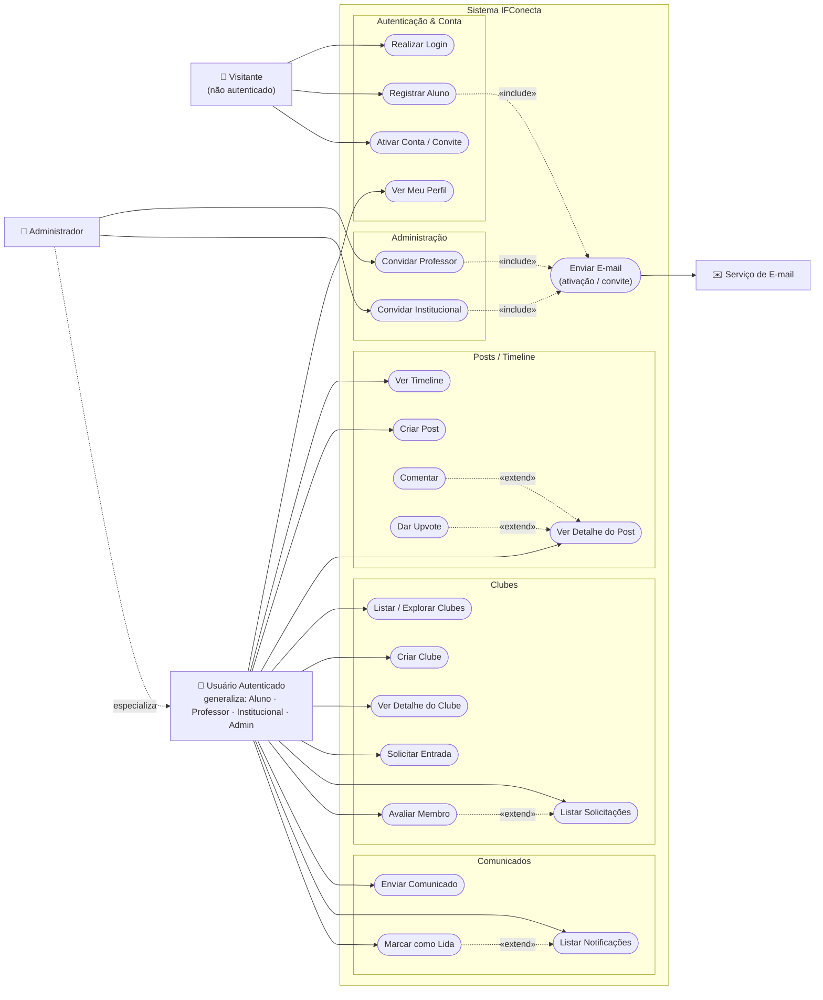
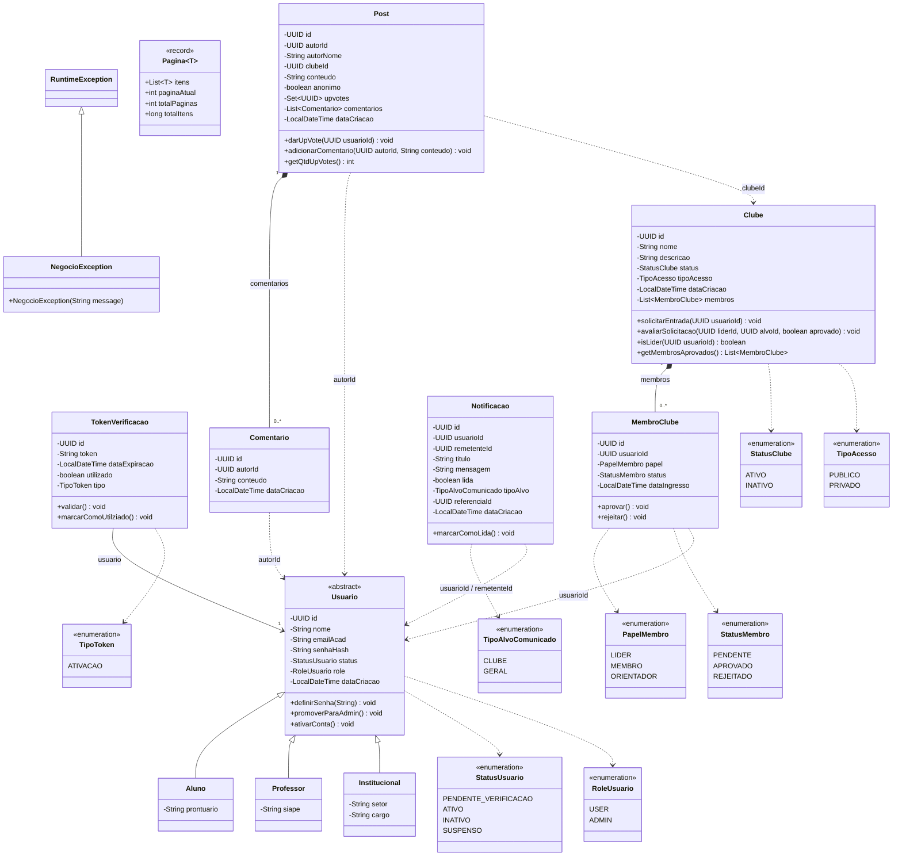
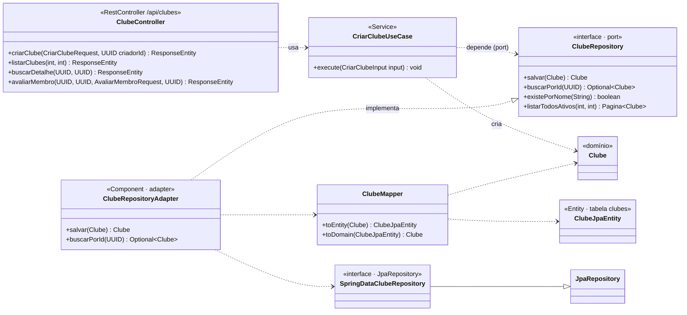

# IFConecta — Diagramas (Casos de Uso e Classes do Backend)

Este documento reúne dois diagramas do **IFConecta** na versão atual (LP1):

1. **Diagrama de Casos de Uso (simplificado)** — quem são os atores e o que cada um pode fazer no sistema.
2. **Diagrama de Classes do Backend** — apresentado em duas visões complementares: o **Modelo de Domínio** (as entidades e suas relações) e a **Arquitetura Hexagonal** (como as camadas — web, aplicação, domínio e infraestrutura — se conectam por *ports* e *adapters*).

> O backend é um servidor **Spring Boot (Java 21)** em **arquitetura hexagonal (Ports & Adapters)**. Os diagramas abaixo são gerados em [Mermaid](https://mermaid.js.org/) e renderizam direto no GitHub/VS Code.

---

## 1. Diagrama de Casos de Uso (simplificado)

### Atores

| Ator | Quem é |
|---|---|
| **Visitante** | Usuário **não autenticado**. Acessa apenas o público: login, cadastro de aluno e ativação de conta/convite. |
| **Usuário Autenticado** | Generalização de **Aluno, Professor, Institucional e Administrador** — todos com `role USER` ou `ADMIN`. Reúne as ações comuns da rede (posts, clubes, notificações, perfil). |
| **Administrador** | Especialização do Usuário Autenticado (`role ADMIN`). Além de tudo que um usuário faz, **convida** professores e institucionais. |
| **Serviço de E-mail** | Ator de **sistema** (externo). Dispara e-mails de **ativação** (cadastro de aluno) e de **convite** (professor/institucional). |

### Observações de autorização (para manter o diagrama "simplificado")

O diagrama generaliza propositalmente. Na prática, algumas ações têm **regras de permissão** que valem citar:

- **Criar Clube:** qualquer usuário autenticado pode; quem cria vira automaticamente o **líder** do clube.
- **Avaliar Membro / Listar Solicitações:** só o **líder** daquele clube.
- **Solicitar Entrada:** em clube **público** a entrada é aprovada na hora; em **privado** fica **pendente** até o líder avaliar.
- **Enviar Comunicado:** o alvo **GERAL** exige perfil **Professor/Institucional/Admin**; o alvo **CLUBE** exige ser **líder** daquele clube (que pode até ser um Aluno).
- **Convidar Professor/Institucional:** exclusivo do **Administrador** (`/api/admin/**`).

Vários casos de uso "primos" foram agrupados para simplificar: por exemplo, **Ver Detalhe do Clube** engloba *listar membros* e *ver a timeline do clube*; **Marcar como Lida** engloba *marcar uma* e *marcar todas*; **Listar Notificações** engloba *contar não lidas*.

---

## 2. Diagrama de Classes do Backend

### Legenda das relações

| Notação | Significado |
|---|---|
| `A <|-- B` | **Generalização / herança** — B é um tipo de A. |
| `A *-- B` | **Composição** — A é dono de B; B não existe sem A (ex.: um Clube e seus membros). |
| `A --> B` | **Associação** — A referencia uma instância de B. |
| `A ..> B` | **Dependência** — A usa B (parâmetro, retorno, referência por ID, ou uso de enum). |
| `A ..|> I` | **Realização** — A implementa a interface/port I. |

### 2.1. Modelo de Domínio

O coração do sistema. São objetos de negócio **puros** (sem anotações de framework). Repare que entidades de módulos diferentes se referenciam **por ID (UUID)**, não por objeto — uma decisão de design para **reduzir o acoplamento** entre os módulos (usuário, clube, post, notificação).

**Pontos a destacar na apresentação:**

- **Herança de usuário:** `Usuario` é **abstrata**; `Aluno`, `Professor` e `Institucional` herdam identidade/credenciais e acrescentam só o que é específico (prontuário, SIAPE, setor/cargo).
- **Regras moram no domínio:** o objeto não é "burro". `Clube.solicitarEntrada()` já decide se o membro entra **aprovado** (clube público) ou **pendente** (privado); `Clube.avaliarSolicitacao()` valida que **só o líder** aprova; `MembroClube.aprovar()/rejeitar()` protegem transições inválidas; `Post`/`Comentario` recusam conteúdo vazio; `TokenVerificacao.validar()` rejeita token expirado/usado. Quando uma regra é violada, lançam **`NegocioException`**.
- **Composição:** um `Clube` **contém** seus `MembroClube`, e um `Post` **contém** seus `Comentario` — eles fazem parte do "todo".
- **Acoplamento por ID:** `MembroClube`, `Post`, `Comentario` e `Notificacao` apontam para usuários/clubes por **UUID**, não por objeto — por isso as setas tracejadas (dependência), e não associação direta.
- **`Pagina<T>`** é um record genérico **compartilhado**: padroniza toda resposta paginada (clubes, posts, comunicados) sem depender do framework.

### 2.2. Arquitetura Hexagonal (Ports & Adapters)

O diagrama de domínio mostra **o que** existe; este mostra **como as camadas se conectam**. A regra de ouro do hexagonal: **o domínio não conhece o framework**. Ele só declara **ports** (interfaces); quem implementa são os **adapters** na infraestrutura. Abaixo, a "fatia vertical" do módulo **Clube** (o mesmo caminho do caso de uso *Criar Clube*):

**Como ler (de cima para baixo):** o `ClubeController` (camada **web**) recebe o `POST /api/clubes` e chama o `CriarClubeUseCase` (camada de **aplicação**). O caso de uso cria o objeto de **domínio** `Clube` e o persiste através do **port** `ClubeRepository` — uma simples interface no domínio. Quem **realiza** esse port é o `ClubeRepositoryAdapter` (camada de **infraestrutura**), que usa o `ClubeMapper` para traduzir entre o domínio (`Clube`) e a entidade JPA (`ClubeJpaEntity`) e delega o acesso ao banco ao `SpringDataClubeRepository`. **O domínio nunca vê JPA nem Spring** — só vê a interface.

### Catálogo de Ports e Adapters

Todos os *ports* (interfaces no domínio) e seus *adapters* (implementações na infraestrutura):

| Port (domínio) | Adapter (infraestrutura) | Tecnologia / papel |
|---|---|---|
| `UsuarioRepository` | `UsuarioRepositoryAdapter` | JPA — persistência de usuários (herança JOINED). |
| `ClubeRepository` | `ClubeRepositoryAdapter` | JPA — persistência de clubes e membros. |
| `PostRepository` | `PostRepositoryAdapter` | JPA — persistência de posts e comentários. |
| `NotificacaoRepository` | `NotificacaoRepositoryAdapter` | JPA — persistência de comunicados. |
| `TokenVerificacaoRepository` | `TokenVerificacaoRepositoryAdapter` | JPA — tokens de ativação/convite. |
| `AuthenticationPort` | `SpringAuthenticationAdapter` | Spring Security — valida e-mail/senha e status. |
| `PasswordEncoderPort` | `BCryptPasswordEncoderAdapter` | BCrypt — gera e confere hash de senha. |
| `TokenServicePort` | `JwtTokenAdapter` | JJWT — gera e lê o token JWT (claims id e role). |
| `EmailValidatorPort` | `AcademicEmailValidatorAdapter` | valida e-mail acadêmico do IFSP. |
| `EmailSenderPort` | `JavaMailSenderAdapter` | Spring Mail — envia e-mails de ativação/convite. |

### Camadas de segurança e configuração (transversais)

Peças que cercam os controllers em toda requisição autenticada:

| Classe | Papel |
|---|---|
| `JwtAuthenticationFilter` | Filtro que lê o `Authorization: Bearer`, valida o JWT e popula o contexto de segurança. |
| `SecurityConfig` | Define a cadeia de filtros **stateless**, as regras de autorização por rota e os handlers de erro. |
| `@CurrentUserId` + `CurrentUserIdArgumentResolver` | Injetam o **UUID do usuário logado** direto nos métodos do controller. |
| `GlobalExceptionHandler` | Traduz `NegocioException` (400), erros de validação (400) e falhas inesperadas (500) em JSON. |
| `JsonAuthenticationEntryPoint` / `JsonAccessDeniedHandler` | Respostas JSON para **401** (não autenticado) e **403** (sem permissão). |
| `AdminSeeder` | Cria a conta administradora padrão na inicialização, se ainda não existir. |

---

## Como os dois diagramas se conectam

O caso de uso **Criar Clube** (diagrama 1) é exatamente o caminho percorrido na fatia hexagonal do **módulo Clube** (diagrama 2.2): a requisição entra pelo `ClubeController`, passa pelo `CriarClubeUseCase`, cria o objeto de domínio `Clube` (que já nasce com o criador como **líder aprovado**) e o grava via `ClubeRepository`/`ClubeRepositoryAdapter`. No frontend desktop, esse mesmo fluxo é disparado pelo modal de criação de clube — veja o passo a passo em [frontend-apresentacao.md](docs/frontend-apresentacao.md#-estudo-de-caso-completo-criar-um-clube).
