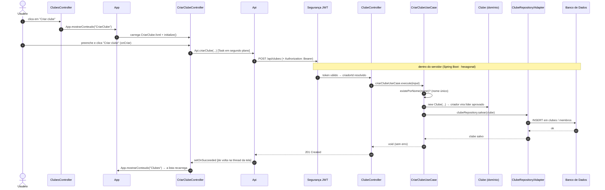

# Guia de Apresentação — Frontend Desktop (JavaFX)

> **Para que serve este documento.** Este é um **roteiro de apresentação**: um guia para você conduzir, do começo ao fim, a explicação do frontend desktop do IFConecta. A ideia é seguir a ordem das seções na hora de falar. Primeiro passamos por **cada parte do código**, em ordem, explicando o papel de cada uma (com atenção especial às **três classes-base**: `App`, `Api` e `Sessao`). Depois, pegamos **um caso de uso real — Criar Clube — e percorremos ele inteiro**, método a método, do clique do usuário até o servidor responder.
>
> O tom é o mesmo do documento [frontend-javafx.md](docs/frontend-javafx.md): explicação acessível, sem assumir que quem ouve conhece JavaFX. Use aquele documento para a **visão geral** (o que é o app, catálogo de telas) e **este** para a **apresentação guiada do código**.
>
> ⚠️ **Escopo.** Este guia descreve **exatamente o que existe no código desta versão (LP1)**: Login, Cadastro, Timeline/Posts, Clubes, Comunicados, Notificações e Admin. Esta versão foi **deliberadamente simplificada para o nível de quem está começando em JavaFX** — sem frameworks de navegação próprios, sem componentes de UI customizados e sem bibliotecas extras de ícones.

---

## Resumo em uma frase (para abrir a apresentação)

O IFConecta Desktop é um aplicativo **JavaFX** (a tecnologia do Java para criar janelas e telas) que **não guarda dados próprios**: cada tela pede as informações ao **mesmo servidor** que o site usa, mostra na janela, e devolve o que o usuário escreve. É "outra porta de entrada" para a rede social do campus, com cara de programa de computador.

Guarde esta frase-mantra, porque ela explica **toda** a organização do código:

> **O FXML desenha a tela · o Controller comanda aquela tela · o `App` troca de tela · a `Api` fala com o servidor · a `Sessao` lembra quem entrou · a `Task` faz o trabalho sem travar a janela.**

---

## O mapa do território (mostre isto primeiro)

Antes de mergulhar, mostre a estrutura de pastas. O código do app vive em `ifconecta-desktop/` e está organizado assim:

```
ifconecta-desktop/src/main/
├── java/com/henrique/ifconecta/desktop/
│   ├── App.java        ← ponto de entrada: abre a janela e troca de tela
│   ├── Api.java        ← quem conversa com o servidor (um arquivo só)
│   ├── Sessao.java     ← lembra o token e o perfil de quem entrou
│   ├── controller/     ← o cérebro de cada tela
│   └── model/          ← os "formatos" dos dados (records)
└── resources/com/henrique/ifconecta/desktop/
    ├── view/*.fxml     ← o "desenho" de cada tela
    └── estilo.css      ← as cores e os estilos (um arquivo só)
```

**Diga ao público:** "São só **três classes-base** — `App`, `Api` e `Sessao` — mais uma pasta de **controllers** (um por tela), uma de **models** (os formatos de dados) e os **FXML** (o desenho das telas). Vamos percorrer nesta ordem: `view`, `controller`, `model`, depois as três classes-base, e por fim o `estilo.css`. No final, pego o caso de uso de **Criar Clube** e mostro como tudo trabalha junto."

> 💡 **Comparação que ajuda (se útil):** uma versão anterior deste app tinha um "Router", uma camada de "Services", um "AsyncRunner" e vários componentes visuais prontos. Aqui isso foi **enxugado de propósito**: navegar virou um método no `App`, todos os Services viraram **um** arquivo `Api`, e o trabalho em segundo plano virou uma `Task` escrita na própria tela. Menos peças, mais fácil de entender.

---

## 1️⃣ `view/` — o desenho de cada tela (os arquivos `.fxml`)

📁 [`ifconecta-desktop/.../resources/.../view/`](ifconecta-desktop/src/main/resources/com/henrique/ifconecta/desktop/view/)

**O que dizer.** Cada arquivo **FXML** é um arquivo de texto (parecido com HTML) que descreve **como a tela é montada**: onde fica cada campo, cada botão, cada título. É puramente o "desenho" — sozinho, um FXML não faz nada. Ele só diz *onde as coisas ficam* e *qual Controller comanda aquela tela* (a linha `fx:controller="..."`). Isso separa o **visual** (FXML) da **lógica** (Controller), exatamente como o site separa HTML de JavaScript.

Há três "tipos" de tela:

- **Telas cheias** (ocupam a janela inteira, antes do login): `Login.fxml`, `Cadastro.fxml`.
- **A moldura** (`AppShell.fxml`): o esqueleto fixo com cabeçalho verde e menu lateral, dentro do qual as telas internas aparecem.
- **Telas internas** (aparecem no centro da moldura): todas as outras. Nesta versão **não há mais "modais" (janelinhas que abrem por cima)** — telas como Criar post e Criar clube agora aparecem **no centro da moldura**, como qualquer outra. Um único jeito de navegar para tudo.

| Arquivo FXML | Tela | Layout raiz | Tipo |
|---|---|---|---|
| `Login.fxml` | Login | `StackPane` (cartão central) | Tela cheia |
| `Cadastro.fxml` | Cadastro de aluno | `StackPane` (cartão central) | Tela cheia |
| `AppShell.fxml` | Moldura (cabeçalho + menu + centro) | `BorderPane` | Casca |
| `Timeline.fxml` | Linha do tempo / feed | `ScrollPane` | Interna |
| `CriarPost.fxml` | Novo post | `ScrollPane` | Interna |
| `PostDetalhe.fxml` | Detalhe do post | `ScrollPane` | Interna |
| `Clubes.fxml` | Lista de clubes | `ScrollPane` | Interna |
| `ClubeDetalhe.fxml` | Detalhe do clube | `ScrollPane` (com `TabPane`) | Interna |
| `CriarClube.fxml` | Criar clube | `ScrollPane` | Interna |
| `Notificacoes.fxml` | Notificações | `ScrollPane` | Interna |
| `Comunicado.fxml` | Enviar comunicado | `ScrollPane` | Interna |
| `Admin.fxml` | Painel administrativo | `ScrollPane` | Interna |

> 💡 **Dica de apresentação:** abra `CriarClube.fxml` no projetor. Mostre como ele é só *estrutura*: um `TextField` para o nome (`fx:id="nomeField"`), um `TextArea` para a descrição, um `ComboBox` para o tipo, e dois botões com `onAction="#onCancelar"` e `onAction="#onCriar"`. Diga: "Esses `fx:id` e `onAction` são os **fios** que ligam o desenho ao cérebro — o Controller."

---

## 2️⃣ `controller/` — o cérebro de cada tela

📁 [`ifconecta-desktop/.../controller/`](ifconecta-desktop/src/main/java/com/henrique/ifconecta/desktop/controller/)

**O que dizer.** Para **cada tela** existe um **Controller**. Ele é o "garçom daquela mesa": reage aos cliques, **valida** o que foi digitado, **pede os dados** à `Api` e **atualiza** o que aparece na tela. Os campos marcados com `@FXML` no Controller são preenchidos automaticamente pelo JavaFX com os componentes que têm o mesmo `fx:id` no FXML — é assim que o cérebro "enxerga" os botões e campos do desenho.

| Controller | Comanda | Faz, em uma frase |
|---|---|---|
| `LoginController` | Login | Valida email/senha, autentica, guarda token + perfil na `Sessao` e abre a área logada na timeline. |
| `CadastroController` | Cadastro | Valida nome, email, senha (mín. 8) e prontuário, registra o aluno e volta ao login. |
| `AppShellController` | Moldura | Mostra o nome do usuário e liga os botões do menu; esconde "Comunicado" e "Painel admin" para quem não pode vê-los. |
| `TimelineController` | Feed | Lista os posts do campus em cartões montados na hora, dá upvote, abre o detalhe e leva ao "Criar post". |
| `CriarPostController` | Novo post | Escreve conteúdo, escolhe clube (opcional), marca anônimo e publica. |
| `PostDetalheController` | Detalhe do post | Mostra o post completo + comentários e permite comentar. |
| `ClubesController` | Lista de clubes | Renderiza "Meus clubes" e "Explorar", abre o detalhe e leva ao "Criar clube". |
| `CriarClubeController` | Criar clube | Coleta nome/descrição/tipo, valida e cria o clube. **(É o nosso estudo de caso no fim.)** |
| `ClubeDetalheController` | Detalhe do clube | Cabeçalho + abas Posts/Membros/Solicitações; ação conforme o papel (membro/líder). |
| `NotificacoesController` | Notificações | Lista comunicados recebidos, marca um ou todos como lidos. |
| `ComunicadoController` | Comunicado | Envia comunicado para um público (Geral ou um Clube). |
| `AdminController` | Admin | Convida professores e institucionais por email (só ADMIN). |

**Padrão que se repete em todo Controller** (vale mostrar uma vez e dizer "todos seguem essa receita"):

1. Um método `initialize()` (chamado pelo JavaFX assim que a tela carrega) prepara a tela e dispara o primeiro carregamento.
2. Métodos `onAlgo()` ligados aos botões reagem aos cliques.
3. Toda busca ou envio de dados roda dentro de uma **`Task`** (uma "tarefa em segundo plano", para não travar a tela) e termina renderizando o resultado (`setOnSucceeded`) ou mostrando um aviso de erro (`setOnFailed`).

> 💡 **Dica:** repare que o Controller **nunca** monta uma requisição HTTP diretamente — ele sempre chama um método da `Api`. E repare no padrão da `Task` (vamos ver de perto no estudo de caso): é **a mesma receita** em todas as telas.

---

## 3️⃣ `model/` — os "formatos" dos dados

📁 [`ifconecta-desktop/.../model/`](ifconecta-desktop/src/main/java/com/henrique/ifconecta/desktop/model/)

**O que dizer.** Os **models** são as "fôrmas" dos dados que viajam entre o app e o servidor. Quase todos são **`record`** do Java — uma forma curtinha de declarar um objeto só de dados (campos imutáveis, sem cerimônia). Quando uma resposta JSON chega do servidor, a `Api` usa o Jackson para "encaixar" esse JSON em um desses records.

| Model | O que representa | Campos principais |
|---|---|---|
| `TokenResponse` | Resposta do login | `token`, `tipo` |
| `MeuPerfil` | Perfil do usuário logado | `nome`, `emailAcad`, `role`, `tipo`… + helpers `isAdmin()`, `podeComunicar()`, `tipoLabel()`, `primeiroNome()` |
| `PostResumo` | Post no feed | `autorNome`, `conteudo`, `qtdUpvotes`, `jaDeiUpvote`, `qtdComentarios`, `dataCriacao` |
| `PostDetalhe` | Post completo | …+ `comentarios: List<Comentario>` |
| `Comentario` | Comentário | `autorNome`, `conteudo`, `dataCriacao` |
| `ClubeResumo` | Clube em lista | `id`, `nome`, `descricao`, `tipoAcesso`, `quantidadeMembros` |
| `ClubeDetalhe` | Clube completo | …+ `liderNome`, `souMembro`, `souLider`, `minhaSituacao` + `temSolicitacaoPendente()` |
| `MembroClube` | Membro de um clube | `nome`, `tipo`, `papel` + `isLider()` |
| `SolicitacaoMembro` | Pedido de entrada pendente | `usuarioNome`, `dataSolicitacao` |
| `NotificacaoResumo` | Comunicado recebido | `titulo`, `mensagem`, `lida`, `remetenteNome`… |

> 💡 **Dica:** destaque que alguns records têm **um ou dois métodos espertinhos** — por exemplo, `MeuPerfil.isAdmin()` decide se o botão "Painel admin" aparece, e `ClubeDetalhe.souLider()` decide o que mostrar no cabeçalho do clube. Não são "regras de negócio" pesadas; são só atalhos de leitura.

---

## 4️⃣ As três classes-base ⭐ (`App`, `Api`, `Sessao`)

Estas três classes ficam **na raiz do pacote** (não numa subpasta) e são a **fundação** do app. São poucas, mas **todo o resto depende delas**. Elas resolvem três problemas que toda tela tem: *como trocar de tela*, *como falar com o servidor* e *como lembrar quem está logado*.

**O que dizer para abrir a seção:** "Se a `view` é o salão e os `controllers` são os garçons, estas três classes são a **fundação e o encanamento do prédio**."

### `App.java` — abre a janela e troca de tela
📄 [`App.java`](ifconecta-desktop/src/main/java/com/henrique/ifconecta/desktop/App.java)

**Por que existe.** É o **ponto de entrada** do programa (a classe que o Java executa primeiro) **e** o lugar que controla a **navegação**. No site, mudar de página é trivial (o navegador faz). No desktop, **alguém** precisa decidir qual `.fxml` carregar e colocá-lo na janela. Esse alguém é o `App`.

**O que faz (poucos métodos, todos simples):**
- `start(...)`: o Java chama este método ao abrir o app. Ele define o título e o tamanho da janela e mostra a tela de **Login**.
- `abrirTelaCheia("Login")`: troca a **janela inteira** por uma tela cheia (usado só por Login e Cadastro).
- `abrirAreaLogada()`: depois do login, carrega a **moldura** (`AppShell`, com cabeçalho e menu) e já mostra a Timeline no centro.
- `mostrarConteudo("Clubes")`: troca **só o miolo central** da moldura, mantendo cabeçalho e menu no lugar. É o que os botões do menu chamam.
- `App.parametro`: uma "caixinha de recado" (um texto público estático). Antes de abrir uma tela que precisa de um dado, a tela atual escreve ali (ex.: o `id` do clube) e a tela de destino lê no seu `initialize()`. É o jeito mais simples de **passar um dado de uma tela para a outra**.
- `avisar("...")` e `erro(excecao)`: mostram uma **janelinha de aviso** (`Alert`) de sucesso ou de erro. É assim que o app dá retorno ao usuário.

> **Frase de efeito:** "O `App` é o único que sabe *trocar de tela*. Centralizar isso em um método (`mostrarConteudo`) evita que cada Controller reinvente a navegação."

### `Api.java` — quem conversa com o servidor
📄 [`Api.java`](ifconecta-desktop/src/main/java/com/henrique/ifconecta/desktop/Api.java)

**Por que existe.** Toda conversa com o servidor passa por aqui. Em vez de cada tela repetir "monta URL, anexa token, converte JSON, trata erro", tudo isso fica **num lugar só**. É **um arquivo** com **um método por endpoint**, com nomes diretos.

**O que faz:**
- **Tem um método para cada ação:** `login(...)`, `meuPerfil()`, `timeline()`, `criarPost(...)`, `listarClubes()`, `criarClube(...)`, `enviarComunicado(...)` e assim por diante. Quem chama só precisa saber o **nome** do método — não precisa saber nada de HTTP.
- **O endereço do servidor** é uma constante no topo: `http://localhost:8080/api`. (Se o backend mudar de lugar, troca-se ali.)
- **Anexa o crachá automaticamente:** lê `Sessao.token` e adiciona o cabeçalho `Authorization: Bearer ...` em todo pedido, se houver alguém logado.
- **(De)serializa JSON** com o Jackson (inclusive datas): transforma o objeto Java em JSON ao enviar, e o JSON da resposta em objeto (um record da pasta `model`) ao receber.
- **Trata erro de forma amigável:** se o servidor estiver fora do ar → "Não foi possível falar com o servidor…"; se vier uma resposta de erro → tenta tirar a mensagem do JSON. Em qualquer falha, ele **lança um erro** que a tela captura e mostra num `Alert`.
- **É bloqueante de propósito:** os métodos esperam a resposta chegar. Por isso **devem** ser chamados de dentro de uma `Task` (segundo plano), nunca direto na thread da tela.

> **Frase de efeito:** "Quase tudo de importante sobre 'falar com o servidor' está nesse arquivo. As telas só dizem *o quê* (`Api.criarClube(...)`); a `Api` resolve o *como* (rede, token, JSON, erro)."

### `Sessao.java` — quem lembra que você está logado
📄 [`Sessao.java`](ifconecta-desktop/src/main/java/com/henrique/ifconecta/desktop/Sessao.java)

**Por que existe.** O servidor não "lembra" do usuário entre um pedido e outro (a API é *stateless*). Então **o app** precisa guardar, enquanto está aberto, **o crachá digital (token JWT)** e o **perfil** do usuário.

**O que faz (é a classe mais simples de todas):**
- Tem só **duas variáveis**: `Sessao.token` (o crachá) e `Sessao.usuario` (o perfil, um `MeuPerfil`).
- No login, o `LoginController` preenche as duas; no "Sair", elas voltam a ser `null`.
- `Sessao.token` é lido pela `Api` a **cada** requisição, para anexar o crachá.
- **Importante:** guarda tudo **só na memória**. Por isso, ao fechar o app, é preciso logar de novo.

> **Resumo das três classes-base (para fechar a seção):** `App` (troca de tela + avisos) · `Api` (fala com o servidor) · `Sessao` (lembra o login). **Três arquivos que sustentam o app inteiro.**

---

## 5️⃣ O `estilo.css` — as cores e os estilos

📄 [`resources/.../estilo.css`](ifconecta-desktop/src/main/resources/com/henrique/ifconecta/desktop/estilo.css)

**O que dizer.** É **um único arquivo CSS** curto que dá a cara do app. Ele define poucas classes simples — `titulo` (texto verde grande), `subtitulo` (cinza menor), `card` (o cartão branco com borda usado nas listas), e os estilos do `cabecalho` e do `menu-lateral`. A cor principal é o **verde institucional** (`#1c7c43`), escrita direto, sem "variáveis de cor". O `App` aplica esse CSS na cena assim que ela é criada.

> 💡 **Dica:** mostre uma classe (ex.: `.card`) e diga: "É CSS de verdade, mas curtinho. Quando uma tela monta um cartão de post, ela só faz `card.getStyleClass().add(\"card\")` e o visual vem daqui."

---

# 🎯 Estudo de caso completo: **Criar um Clube**

> Esta é a hora de "amarrar tudo". Vamos seguir um clube sendo criado, **do clique até o banco de dados e de volta**, passando por cada peça que apresentamos — primeiro no app e depois **dentro do servidor**. Mantenha aberto o diagrama abaixo enquanto narra.

## Visão geral do fluxo



## Passo a passo, método a método

### ① O usuário clica em "Criar clube" → `ClubesController.onCriarClube()`
📄 [`ClubesController.java`](ifconecta-desktop/src/main/java/com/henrique/ifconecta/desktop/controller/ClubesController.java)

```java
@FXML
private void onCriarClube() {
    App.mostrarConteudo("CriarClube");
}
```

**O que explicar.** Este método (ligado ao botão "Criar clube" pelo `onAction="#onCriarClube"` no FXML da tela de clubes) faz **uma coisa só**: pede ao `App` para mostrar a tela de criação no centro da moldura. Sem janela modal, sem callback — é a **mesma forma** de navegar de qualquer botão do app.

### ② `App.mostrarConteudo("CriarClube")` coloca a tela no centro
📄 [`App.java`](ifconecta-desktop/src/main/java/com/henrique/ifconecta/desktop/App.java)

```java
public static void mostrarConteudo(String nomeFxml) {
    try {
        Parent tela = FXMLLoader.load(App.class.getResource("view/" + nomeFxml + ".fxml"));
        areaLogada.setCenter(tela);
    } catch (Exception e) {
        erro(e);
    }
}
```

**O que explicar.** O `App` usa o `FXMLLoader` para transformar o `CriarClube.fxml` numa tela viva (isso já dispara o `initialize()` do `CriarClubeController`) e a coloca no **centro** da moldura (`areaLogada.setCenter(...)`). O cabeçalho e o menu continuam no lugar. Se der qualquer erro ao carregar, mostra um `Alert`.

### ③ `initialize()` prepara o formulário
📄 [`CriarClubeController.java`](ifconecta-desktop/src/main/java/com/henrique/ifconecta/desktop/controller/CriarClubeController.java)

```java
@FXML
public void initialize() {
    tipoCombo.getItems().addAll("Publico", "Privado");
    tipoCombo.getSelectionModel().selectFirst();
}
```

**O que explicar.** Chamado automaticamente pelo JavaFX assim que a tela carrega. Ele preenche a caixinha de seleção (`ComboBox`) com as duas opções e já deixa "Publico" escolhida. Simples assim — sem conversores nem truques.

### ④ O usuário preenche e clica "Criar clube" → `onCriar()`
```java
@FXML
private void onCriar() {
    String nome = nomeField.getText().trim();
    String descricao = descricaoArea.getText().trim();
    if (nome.isEmpty() || descricao.isEmpty()) {
        App.avisar("Preencha nome e descricao.");
        return;
    }
    String tipo = "Publico".equals(tipoCombo.getValue()) ? "PUBLICO" : "PRIVADO";

    Task<Void> tarefa = new Task<>() {
        @Override
        protected Void call() {
            Api.criarClube(nome, descricao, tipo);
            return null;
        }
    };
    tarefa.setOnSucceeded(evento -> App.mostrarConteudo("Clubes"));
    tarefa.setOnFailed(evento -> App.erro(tarefa.getException()));
    new Thread(tarefa).start();
}
```

**O que explicar (o coração do caso de uso).** Este método junta **as peças** que apresentamos:

1. **Validação no cliente:** lê e "apara" (`trim`) os campos; se faltar algo, mostra um aviso **sem nem chamar o servidor** (`App.avisar`) e o `return` interrompe ali.
2. **Traduz o rótulo amigável para o valor da API:** o usuário vê "Publico", mas o servidor recebe `"PUBLICO"`.
3. **A `Task` (o "trabalho em segundo plano"):** dentro do `call()` está a única linha que conversa com o servidor — `Api.criarClube(...)`. Como isso roda em **outra thread** (`new Thread(tarefa).start()`), a janela **não trava** enquanto espera.
4. **De volta à tela:** quando o servidor responde, o JavaFX chama `setOnSucceeded` **na thread da tela** — e aí navegamos para "Clubes" (que recarrega e já mostra o clube novo). Se algo der errado, `setOnFailed` mostra a mensagem num `Alert`.

> **Diga:** "Essa receita — validar, montar uma `Task`, chamar a `Api` no `call()`, e tratar sucesso/erro — é **exatamente** a mesma em todas as telas. Quem entende uma, entende todas."

### ⑤ `Api.criarClube(...)` monta e envia o pedido
📄 [`Api.java`](ifconecta-desktop/src/main/java/com/henrique/ifconecta/desktop/Api.java)

```java
public static void criarClube(String nome, String descricao, String tipoAcesso) {
    HashMap<String, Object> corpo = new HashMap<>();
    corpo.put("nome", nome);
    corpo.put("descricao", descricao);
    corpo.put("tipoAcesso", tipoAcesso);
    enviar("POST", "/clubes", corpo);
}
```

**O que explicar.** O método monta o **corpo** do pedido (um mapa que vira JSON) e chama a parte interna `enviar(...)`, dizendo só o **verbo** (`POST`) e o **caminho** (`/clubes`). Dentro de `enviar(...)`, o "carteiro" entra em ação:
- monta a URL completa (`http://localhost:8080/api/clubes`);
- pega o **token** da `Sessao` e adiciona `Authorization: Bearer ...` — é assim que o servidor sabe **quem** está criando o clube (o criador vira o **líder**!);
- transforma o mapa em **JSON** e envia o `POST`.

A partir daqui **saímos do app e entramos no servidor**. Vamos seguir o pedido lá dentro, na ordem em que ele passa por cada camada.

---

> 🖥️ **A partir daqui é o backend.** O servidor é um **Spring Boot (Java 21)** em **arquitetura hexagonal**, organizado em camadas: **web** (recebe o pedido) → **aplicação** (regras do caso de uso) → **domínio** (as regras do próprio objeto) → **infraestrutura** (banco). *(Os diagramas completos do backend estão em [diagramas.md](docs/diagramas.md).)*

### ⑥ A segurança confere o crachá (antes de tudo)
Todo pedido autenticado passa primeiro por um **filtro de segurança** (`JwtAuthenticationFilter`): ele lê o cabeçalho `Authorization: Bearer ...`, **valida o token JWT** e descobre **quem** é o usuário. Esse `id` é entregue ao controller pela anotação `@CurrentUserId`. Se o token faltar ou for inválido, o pedido **nem chega** ao controller — o servidor responde **401** e o app manda de volta para o login.

### ⑦ `ClubeController` recebe o `POST /api/clubes`
📄 [`ClubeController.java`](src/main/java/com/henrique/ifconecta/infrastructure/web/clube/controller/ClubeController.java) — camada **web**

```java
@PostMapping
public ResponseEntity<Void> criarClube(@RequestBody @Valid CriarClubeRequest request,
        @CurrentUserId UUID criadorId) {
    CriarClubeInput input = new CriarClubeInput(
            request.nome(), request.descricao(), request.tipoAcesso(), criadorId);
    criarClubeUseCase.execute(input);
    return ResponseEntity.status(HttpStatus.CREATED).build();
}
```

**O que explicar.** O JSON do corpo vira um `CriarClubeRequest` e o `@Valid` confere o formato. O controller junta os dados do corpo com o `criadorId` (vindo do crachá, passo ⑥) num `CriarClubeInput` e chama o **caso de uso**. Repare: o controller **não tem regra de negócio** — ele só recebe, organiza e delega.

### ⑧ `CriarClubeUseCase` aplica as regras
📄 [`CriarClubeUseCase.java`](src/main/java/com/henrique/ifconecta/application/clube/usecase/CriarClubeUseCase.java) — camada de **aplicação**

```java
@Transactional
public void execute(CriarClubeInput input) {
    if (clubeRepository.existePorNome(input.nome())) {
        throw new NegocioException("Já existe um clube registrado com este nome.");
    }
    Clube novoClube = new Clube(
            input.nome(), input.descricao(), input.tipoAcesso(), input.criadorId());
    clubeRepository.salvar(novoClube);
}
```

**O que explicar.** Aqui ficam as **regras do caso de uso**: primeiro garante que **não existe outro clube com o mesmo nome** (se existir, lança `NegocioException`); depois cria o objeto de domínio `Clube` e manda **salvar** pelo `ClubeRepository`. Note que ele depende só da **interface** `ClubeRepository` (um *port*) — não sabe nada de banco.

### ⑨ O domínio `Clube` nasce já com o líder
📄 [`Clube.java`](src/main/java/com/henrique/ifconecta/domain/clube/model/Clube.java) — camada de **domínio** (Java puro, sem Spring)

```java
public Clube(String nome, String descricao, TipoAcesso tipoAcesso, UUID criadorId) {
    this.id = UUID.randomUUID();
    this.status = StatusClube.ATIVO;
    // ...
    this.membros = new ArrayList<>();
    // O criador é líder e aprovado automaticamente:
    this.membros.add(new MembroClube(criadorId, PapelMembro.LIDER, StatusMembro.APROVADO));
}
```

**O que explicar.** A regra mais importante mora **dentro do próprio objeto**: ao nascer, o clube **já se adiciona o criador como `MembroClube` com papel `LIDER` e status `APROVADO`**. Não é o controller nem o caso de uso que "lembram" disso — é o **domínio que protege a própria regra**. (É por isso que, ao voltar para a lista, quem criou já aparece como líder.)

### ⑩ `ClubeRepository` → `Adapter` → banco
📄 [`ClubeRepositoryAdapter.java`](src/main/java/com/henrique/ifconecta/infrastructure/persistence/clube/adapter/ClubeRepositoryAdapter.java) — camada de **infraestrutura**

```java
@Override
public Clube salvar(Clube clube) {
    ClubeJpaEntity entity = clubeMapper.toEntity(clube);            // domínio → entidade JPA
    ClubeJpaEntity salvo = springDataClubeRepository.save(entity);  // INSERT no banco
    return clubeMapper.toDomain(salvo);                            // entidade → domínio
}
```

**O que explicar.** `ClubeRepository` é só uma **interface no domínio** (o *port*); quem a **realiza** é o `ClubeRepositoryAdapter` (o *adapter*). Ele usa o `ClubeMapper` para traduzir o `Clube` (domínio) em `ClubeJpaEntity` (a "forma de tabela") e o `SpringDataClubeRepository` (JPA/Hibernate) para fazer o **`INSERT`** nas tabelas de clubes e de membros. **O domínio nunca vê JPA nem Spring** — essa é a regra de ouro do hexagonal.

### ⑪ O servidor responde `201 Created`
Gravado o clube, o caso de uso termina sem erro e o `ClubeController` devolve **`201 Created`** (sem corpo). *(Se em algum passo um `NegocioException` tivesse sido lançado — por exemplo, nome repetido —, o `GlobalExceptionHandler` o traduziria em um **`400`** com a mensagem em JSON, que o app mostraria no `Alert`.)*

### ⑫ De volta à tela: sucesso
Quando o `201` chega **de volta ao app**, o JavaFX devolve o controle para a **thread da tela** e executa o `setOnSucceeded` do passo ④:
- `App.mostrarConteudo("Clubes")` → a tela de Clubes é carregada de novo e, no seu `initialize()`, busca a lista atualizada no servidor — então **o clube novo já aparece** (com você como líder).

### O que esse caso de uso prova
Em um único fluxo, o usuário viu **todas as peças trabalhando juntas**:

| Peça | Camada | Papel no Criar Clube |
|---|---|---|
| `CriarClube.fxml` | front · view | desenhou o formulário |
| `CriarClubeController` | front · controller | validou os campos e disparou a `Task` |
| `Task` | front · segundo plano | rodou a chamada sem travar a tela |
| `Sessao` | front · login | forneceu o token JWT para o pedido |
| `Api` | front · HTTP | montou o corpo, anexou o crachá e enviou o `POST` |
| `JwtAuthenticationFilter` + `@CurrentUserId` | back · segurança | validou o token e identificou o criador |
| `ClubeController` | back · web | recebeu o `POST` e montou o `CriarClubeInput` |
| `CriarClubeUseCase` | back · aplicação | checou o nome único e orquestrou a criação |
| `Clube` | back · domínio | nasceu já com o criador como líder aprovado |
| `ClubeRepository` + `Adapter` + `Mapper` | back · infraestrutura | traduziram o domínio e gravaram no banco |
| `App` | front · navegação | trocou de volta para a lista de clubes |

> **Feche assim:** "É essa separação de responsabilidades — cada peça com um trabalho claro — que faz o app ser fácil de entender e de crescer. Adicionar uma nova tela é repetir essa mesma receita."

---

## Apêndice — Roteiro enxuto (cola para o dia)

1. **Abra com a frase-mantra:** FXML desenha · Controller comanda · App troca de tela · Api fala com o servidor · Sessao lembra o login · Task não trava.
2. **Mostre o mapa de pastas** e diga a ordem que vai seguir.
3. **`view`** → abra um `.fxml`, aponte `fx:id` e `onAction`.
4. **`controller`** → mostre a tabela; diga "um por tela, e nunca chamam HTTP direto".
5. **`model`** → "records: as fôrmas dos dados; alguns com helpers de leitura".
6. **As três classes-base (devagar!)** → `App` (troca de tela + avisos), `Api` (fala com o servidor), `Sessao` (lembra o login) — *por que cada uma existe*.
7. **`estilo.css`** → "um CSS curtinho; o verde institucional vem daqui".
8. **Criar Clube** → siga o diagrama de sequência **do clique até o banco e de volta**; destaque a receita da `Task` (no app) e as camadas do backend (**Segurança → Controller → UseCase → domínio → Repository → banco**).
9. **Feche** com a tabela "o que esse caso de uso prova" (front + back).
