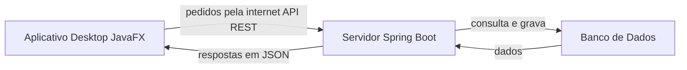
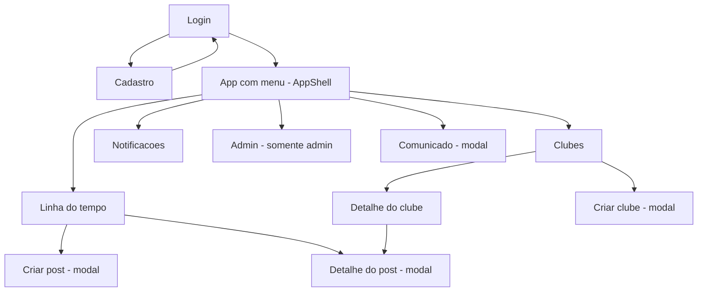

# IFConecta Desktop (JavaFX): Como Funciona o Frontend para Computador

O **IFConecta** é uma rede social acadêmica do IFSP Campus Salto — um espaço onde alunos, professores e servidores podem postar, participar de clubes, receber comunicados e conversar dentro da comunidade do campus. Além do site (a versão web), o projeto tem também um **frontend desktop em JavaFX**: um programa de computador instalável, separado do site, que roda direto na máquina do usuário (com janela própria, menu, telas etc.). Esse programa **não tem dados próprios**: ele conversa pela internet com o **mesmo servidor** que o site usa. Ou seja, é "outra porta de entrada" para o IFConecta — uma versão para desktop que mostra e envia as mesmas informações, só que com cara de aplicativo de computador em vez de página de navegador.

---

## Visão geral em 30 segundos

O IFConecta Desktop é um aplicativo feito em JavaFX (a tecnologia do Java para criar janelas e telas). Ele tem telas como Login, Linha do tempo, Clubes, Notificações e um painel de Admin. O aplicativo **não guarda nada por conta própria**: cada tela pede os dados ao servidor pela internet, recebe a resposta e mostra na janela. Quando você faz login, o servidor devolve um "crachá digital" (token) que o app apresenta em cada pedido seguinte para provar quem você é. As buscas de dados rodam "em segundo plano" para a tela nunca travar.

---

## Como as peças se encaixam

- **Aplicativo Desktop (JavaFX):** o programa que roda no computador do usuário, com as janelas e telas. É a parte que este documento explica.
- **API REST (a conversa pela internet):** o "idioma" e o caminho pelos quais o app pede e recebe dados do servidor — como pedidos e respostas padronizados que viajam pela rede.
- **Servidor (Spring Boot):** o "cérebro central" do IFConecta, que recebe os pedidos, aplica as regras e responde. É o mesmo servidor que atende o site.
- **Banco de Dados:** onde tudo fica guardado de verdade (usuários, posts, clubes). Só o servidor fala com ele.

---

## As tecnologias usadas

- **Java 21:** a linguagem de programação em que o app é escrito (versão 21).
- **JavaFX 21:** a "caixa de ferramentas" do Java para criar a interface gráfica — janelas, botões, listas e telas.
- **FXML:** um arquivo de texto que descreve como cada tela é montada (onde fica cada campo e botão), separando o "desenho" da tela do código que a faz funcionar.
- **Jackson:** a biblioteca que traduz os dados entre o formato que viaja na internet (JSON) e os objetos do Java — inclusive datas e horas.
- **java.net.http (HttpClient):** o "carteiro" nativo do Java que envia os pedidos pela internet e traz as respostas, sem precisar de biblioteca extra.
- **Ikonli (Feather):** a coleção de ícones de linha (setinhas, sino, etc.) usada nos botões, equivalente aos ícones do site.
- **Maven:** a ferramenta que organiza as dependências (bibliotecas) e compila/roda o projeto.
- **Plugins do Maven (compiler e javafx):** ferramentas que compilam o código e iniciam o aplicativo com um único comando.

---

## Como funciona por dentro

Pense no aplicativo como um **restaurante**, onde cada parte tem um papel:

- **Telas (FXML) = o salão e a decoração.** Cada arquivo FXML é o "desenho" de uma tela: onde ficam os campos, os botões, os títulos. É o que o cliente vê, mas sozinho não faz nada.
- **Controllers = o cérebro de cada tela (o garçom daquela mesa).** Para cada tela existe um Controller que reage aos cliques, valida o que foi digitado, pede dados e atualiza o que aparece. Cada tela tem o seu (ex.: a tela de Login tem o `LoginController`).
- **Router = o maître que troca de tela.** É o `Router` quem decide qual tela mostrar e faz a troca. Existe só um (padrão *singleton* — uma única instância usada por todo o app). Há telas de **tela cheia** (Login, Cadastro) que ocupam a janela inteira, e telas **internas** que ficam dentro de uma moldura fixa chamada **AppShell** (com topo e menu lateral): ao navegar entre elas, só o "miolo" do centro muda, mantendo o menu no lugar. Ele também consegue **entregar um dado para a tela de destino** (por exemplo, "abra o detalhe do post número 42"), o que substitui os endereços com parâmetros do site (tipo `/post/42`).
- **Services = quem vai à cozinha buscar os dados (no servidor).** Cada *Service* sabe conversar com o servidor sobre um assunto: `PostService` cuida dos posts, `ClubeService` dos clubes, e assim por diante. Eles usam o "carteiro" central (`ApiClient`) para enviar e receber.
- **Session = quem lembra que você está logado.** A `Session` guarda na memória o seu "crachá" (token) e seu perfil enquanto o app está aberto. É consultada o tempo todo para saber se você está logado e para anexar o crachá nos pedidos.

Em resumo: o **FXML desenha**, o **Controller comanda** aquela tela, o **Router troca** de tela, os **Services buscam** os dados no servidor e a **Session lembra** quem é você.

---

## O catálogo de telas

| Tela | O que o usuário vê | O que dá pra fazer |
|---|---|---|
| **Login** | Tela cheia em duas partes: à esquerda a marca IFConecta e uma frase de boas-vindas; à direita o formulário com email e senha (com botão de olho para mostrar/esconder) e o botão Entrar. | Digitar email e senha e entrar (clicando ou apertando Enter), mostrar/esconder a senha, ir para Cadastro. Sucesso leva à timeline; erro mostra um aviso. |
| **Cadastro** | Tela cheia em duas partes: à esquerda a marca convidando a entrar na comunidade; à direita o formulário de conta de aluno com nome, email, senha e prontuário. | Preencher os dados (senha de no mínimo 8 caracteres, prontuário no formato SL000000X) e cadastrar. Validação por campo; ao concluir avisa que a conta foi criada e que um email de ativação foi enviado, e volta ao Login. |
| **Linha do tempo / feed** | Página principal do app, com título Timeline, um compositor no topo (avatar + "No que você está pensando, [nome]?") e o feed de posts em cartões, com indicador de carregamento e botão Carregar mais. | Ler os posts do campus (em páginas), dar upvote, abrir o detalhe de um post, criar um novo post e carregar posts mais antigos. |
| **Criar post** | Janela modal "Novo post" com área de texto, lista para escolher um clube (opcional), caixa "Postar como anônimo" e botões Cancelar e Publicar. | Escrever o conteúdo, opcionalmente escolher um clube e marcar anônimo, e publicar. Conteúdo vazio mostra erro; ao publicar, a timeline recarrega e o modal fecha. |
| **Detalhe do post** | Janela modal "Post" com autor (ou "Anônimo"), tempo, corpo do post, contagem de upvotes e a lista de comentários; no rodapé, campo para comentar e botões Comentar e Fechar. | Ler o post completo e os comentários, escrever um novo comentário (campo vazio avisa) e fechar o modal. |
| **Shell / Moldura principal** | A moldura fixa: barra no topo com a marca; menu lateral à esquerda agrupado em Feed (e Admin para quem é admin); centro que troca de conteúdo. No topo direito: Comunicado, sino de notificações (com contador) e avatar da conta. | Navegar pelo menu lateral, abrir o modal de Comunicado (quem pode), abrir notificações pelo sino e usar o avatar para Sair. |
| **Clubes** | Página Clubes com dois blocos: Meus clubes e Explorar (paginado). Cada clube é um cartão com nome, descrição, selo Público/Privado e número de membros. Botão Criar clube no topo e Carregar mais. | Abrir o detalhe de um clube, criar um clube (modal) e carregar mais clubes da lista Explorar. |
| **Detalhe do clube** | Página de um clube com cabeçalho (nome, descrição, selo, membros, líder) e uma ação conforme seu papel (Comunicado se líder, "Você é membro", "Solicitação enviada" ou "Solicitar entrada"). Abas Posts, Membros e (só líder) Solicitações. | Trocar de aba; solicitar entrada; se líder, enviar comunicado, criar post e aprovar/recusar solicitações; dar upvote e abrir detalhe de post; voltar para Clubes. |
| **Criar clube** | Janela modal "Criar clube" com nome, descrição e tipo de acesso (Público ou Privado), além de mensagem de erro e botões Cancelar e Criar clube. | Preencher e criar (ou cancelar). Ao criar, a lista de clubes recarrega e o modal fecha. |
| **Comunicado** | Janela modal para enviar comunicado, avisando que chega como notificação ao público escolhido; campos de título e mensagem, lista de Público (Geral ou Clube) e um campo extra conforme a escolha. Quando aberto pelo líder de um clube, fica travado naquele clube. | Digitar título e mensagem, escolher o público (e o destino específico, se preciso) e enviar (ou cancelar). Ao enviar, o modal fecha. |
| **Notificações** | Página "Notificações" com os comunicados recebidos; cada item mostra título (com selo "Nova" quando não lido), quem enviou e há quanto tempo, e a mensagem. Botão Marcar como lida por item, Marcar todas no topo e Carregar mais no rodapé. | Marcar uma ou todas como lidas e carregar mais notificações. A lista recarrega após cada ação. |
| **Admin (Painel administrativo)** | Página só para admin com dois cartões: Convidar professor (nome, email, SIAPE) e Convidar institucional (nome, email, setor, cargo). | Convidar professores e servidores institucionais por email. Após cada ação bem-sucedida, os campos são limpos. |

---

## Como o usuário navega

A jornada começa no **Login**, de onde dá para ir ao **Cadastro** (que volta ao Login). Depois de logar, o usuário entra no **app com menu (AppShell)** e, pelo menu lateral, alcança Linha do tempo, Clubes, Notificações e (se for admin) o painel Admin. A partir da Linha do tempo dá pra abrir **Criar post** e o **Detalhe do post**; de Clubes, abrir o **Detalhe do clube** e **Criar clube**. O **Comunicado** abre como uma janelinha (modal) sobre a tela atual.

---

## Conversando com o servidor

Toda a conversa com o servidor passa por uma peça central, o **ApiClient** (o "carteiro" do app). Quando você faz **login**, o servidor confere email e senha e devolve um **token JWT** — pense nele como um **crachá digital** que prova quem você é. O app guarda esse crachá na memória (na `Session`) e, **a cada novo pedido**, o ApiClient anexa o crachá automaticamente (no cabeçalho `Authorization: Bearer ...`), para o servidor reconhecer o usuário sem precisar digitar a senha de novo.

A **URL base** (o endereço do servidor) é, por padrão, **`http://localhost:8080/api`** — ou seja, o servidor rodando na própria máquina. Esse endereço pode ser trocado por uma variável de ambiente (`IFCONECTA_API_URL`) caso o servidor esteja em outro lugar.

Dois detalhes importantes para a tela funcionar bem:

- **Tudo em segundo plano:** buscar dados pela internet pode demorar. Para a tela **não travar** enquanto espera, esses pedidos rodam numa **thread** separada (um "ajudante" que trabalha em paralelo, em segundo plano) por meio do `AsyncRunner`. Quando a resposta chega, o resultado é entregue de volta com segurança para a tela, que então se atualiza. A janela continua respondendo o tempo todo.
- **Sessão expirada volta pro login:** se o crachá vence (ou fica inválido) e o servidor responde "não autorizado", o app **limpa a sessão, volta para o Login e mostra um aviso** ("Sessão expirada — Entre novamente para continuar."). Há um cuidado: isso só acontece se você **já estava logado**; um erro de senha errada na própria tela de Login apenas mostra a mensagem, sem recarregar nada.

Quando algo dá errado, o app traduz para mensagens amigáveis: por exemplo, se o servidor estiver fora do ar, aparece "Não foi possível conectar ao servidor. Verifique se o backend está no ar.".

---

## A aparência: tema e componentes

O app usa um **tema claro**. As cores ficam definidas em "fichas de cor" (variáveis chamadas *tokens*) no arquivo `tokens.css`, e as regras de estilo (em `app.css`) **nunca usam cores fixas** — sempre apontam para esses tokens. Assim a paleta inteira fica centralizada num só lugar, e a cor principal é o verde institucional.

Para não repetir código, o app tem **componentes reutilizáveis** (pequenas peças prontas usadas em várias telas):

- **PostCard:** monta o cartão visual de um post (autor, tempo, texto e botões de upvote e comentários). É reaproveitado na Timeline e no Detalhe do clube.
- **Toast:** o aviso temporário que aparece no canto, some sozinho e tem versões de sucesso (verde), erro (vermelho) e informação (neutro).
- **Modal:** a janela secundária que abre por cima e bloqueia a principal até ser fechada — usada nos formulários (criar post, criar clube, etc.).
- **Avatar:** a "foto" do usuário feita com as iniciais do nome e uma cor estável (o mesmo nome sempre ganha a mesma cor), sem usar imagem.
- **Icons:** atalho para criar os ícones de linha (Feather), como as setinhas de upvote e o ícone de comentários.
- **Format:** utilitário que deixa datas legíveis (ex.: "21/05/2026 às 14:30") e mostra tempo relativo ("há 5m", "ontem", "há 3 dias").
- **Theme:** aplica os estilos (tema claro) a cada janela, inclusive nos modais.

---

## Como executar o app

1. **Tenha o JDK 21 (Java 21) instalado** e o **Maven** disponível na máquina.
2. **Garanta que o servidor (back-end / API) esteja rodando** antes de abrir o app — sem ele, as telas não conseguem buscar dados. Por padrão o app procura o servidor em `http://localhost:8080` (chamando `http://localhost:8080/api`).
3. **Se o servidor estiver em outro endereço**, defina a variável de ambiente antes de rodar. No PowerShell: `$env:IFCONECTA_API_URL = 'http://meu-servidor:8080'`.
4. **Abra o terminal na pasta do módulo desktop** (`ifconecta-desktop`, onde fica o `pom.xml`).
5. **Rode o comando:** `mvn javafx:run`. Isso baixa as dependências, compila e abre a janela do app já na tela de Login.
6. **Faça login** para entrar. Lembre-se: a sessão fica só na memória, então **ao fechar o app você precisará logar de novo** na próxima vez.

---

## Roteiro sugerido para a apresentação

- **Abra dizendo o que é:** o IFConecta é a rede social do campus e este é o aplicativo de computador (JavaFX) que conversa com o mesmo servidor do site — bom para resumir em uma frase a "Visão geral em 30 segundos".
- **Mostre o diagrama "Como as peças se encaixam":** App Desktop → API REST → Servidor → Banco. Explique que o app não guarda dados, só pede ao servidor.
- **Abra o app e faça o login ao vivo:** destaque o crachá digital (token JWT) que o servidor devolve e que o app passa a apresentar em cada pedido.
- **Navegue pelo menu lateral:** mostre a Linha do tempo (crie ou abra um post), entre em Clubes e abra o Detalhe de um clube, e passe por Notificações — assim cobre o catálogo de telas sem decorar tudo.
- **Explique o "segundo plano":** comente que, ao carregar dados, a tela não trava porque o trabalho roda numa thread separada — bom momento para mostrar o indicador de "carregando".
- **Mostre um modal e um toast:** abra "Criar post" (modal) e publique para aparecer o aviso de sucesso (toast) — ilustra os componentes reutilizáveis.
- **Feche reforçando a arquitetura:** Telas (FXML) desenham, Controllers comandam, Router troca de tela, Services buscam no servidor e Session lembra o login — e, se quiser, mostre o painel Admin como exemplo de tela que aparece só para certos perfis.

---

## Glossário rápido

| Termo | O que significa |
|---|---|
| **JavaFX** | Caixa de ferramentas do Java para criar interfaces gráficas (janelas, botões, telas) — é com ela que o app desktop é feito. |
| **FXML** | Arquivo de texto que descreve o "desenho" de uma tela (onde fica cada campo e botão), separado do código que a faz funcionar. |
| **Controller** | O "cérebro" de uma tela: reage aos cliques, valida o que foi digitado e atualiza o que aparece. Cada tela tem o seu. |
| **API REST** | A forma padronizada de o app pedir e receber dados do servidor pela internet, com pedidos e respostas combinados. |
| **JWT** | Um "crachá digital" que o servidor entrega no login; o app o apresenta em cada pedido para provar quem é o usuário. |
| **Backend / Servidor** | O "cérebro central" do IFConecta (em Spring Boot) que aplica as regras, guarda os dados e responde aos pedidos do app. |
| **Thread / segundo plano** | Um "ajudante" que trabalha em paralelo; usado para buscar dados sem travar a tela enquanto a resposta não chega. |
