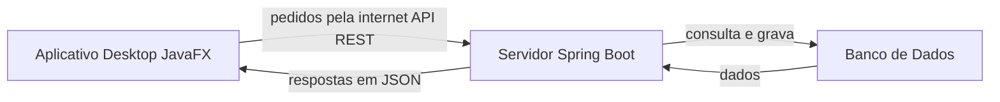
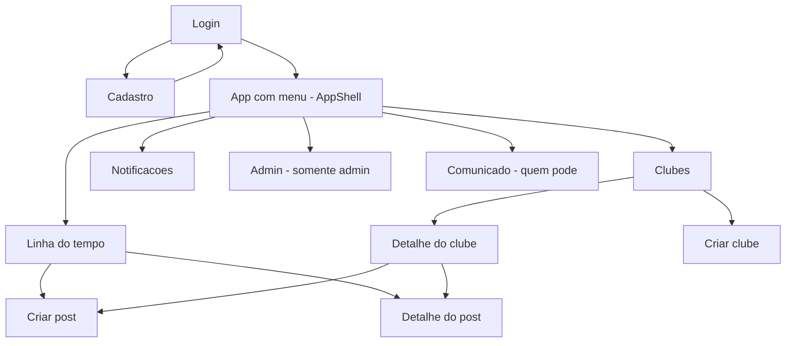

# IFConecta Desktop (JavaFX): Como Funciona o Frontend para Computador

O **IFConecta** é uma rede social acadêmica do IFSP Campus Salto — um espaço onde alunos, professores e servidores podem postar, participar de clubes, receber comunicados e conversar dentro da comunidade do campus. Além do site (a versão web), o projeto tem também um **frontend desktop em JavaFX**: um programa de computador instalável, separado do site, que roda direto na máquina do usuário (com janela própria, menu, telas etc.). Esse programa **não tem dados próprios**: ele conversa pela internet com o **mesmo servidor** que o site usa. Ou seja, é "outra porta de entrada" para o IFConecta — uma versão para desktop que mostra e envia as mesmas informações, só que com cara de aplicativo de computador em vez de página de navegador.

> 📌 **Sobre esta versão (LP1).** O código foi **deliberadamente simplificado para o nível de quem está começando em JavaFX**: a navegação é só um método que troca a tela, toda a conversa com o servidor fica em **um único arquivo** (`Api`), e o trabalho em segundo plano é uma `Task` escrita na própria tela — sem frameworks próprios, sem componentes visuais customizados e sem bibliotecas extras de ícones.

---

## Visão geral em 30 segundos

O IFConecta Desktop é um aplicativo feito em JavaFX (a tecnologia do Java para criar janelas e telas). Ele tem telas como Login, Linha do tempo, Clubes, Notificações e um painel de Admin. O aplicativo **não guarda nada por conta própria**: cada tela pede os dados ao servidor pela internet, recebe a resposta e mostra na janela. Quando você faz login, o servidor devolve um "crachá digital" (token) que o app apresenta em cada pedido seguinte para provar quem você é. As buscas de dados rodam "em segundo plano" para a tela nunca travar.

---

## Como as peças se encaixam

- **Aplicativo Desktop (JavaFX):** o programa que roda no computador do usuário, com as janelas e telas. É a parte que este documento explica.
- **API REST (a conversa pela internet):** o "idioma" e o caminho pelos quais o app pede e recebe dados do servidor — como pedidos e respostas padronizados que viajam pela rede.
- **Servidor (Spring Boot):** o "cérebro central" do IFConecta, que recebe os pedidos, aplica as regras e responde. É o mesmo servidor que atende o site.
- **Banco de Dados:** onde tudo fica guardado de verdade (usuários, posts, clubes). Só o servidor fala com ele.

---

## As tecnologias usadas

- **Java 21:** a linguagem de programação em que o app é escrito (versão 21).
- **JavaFX 21:** a "caixa de ferramentas" do Java para criar a interface gráfica — janelas, botões, listas e telas.
- **FXML:** um arquivo de texto que descreve como cada tela é montada (onde fica cada campo e botão), separando o "desenho" da tela do código que a faz funcionar.
- **Jackson:** a biblioteca que traduz os dados entre o formato que viaja na internet (JSON) e os objetos do Java — inclusive datas e horas.
- **java.net.http (HttpClient):** o "carteiro" nativo do Java que envia os pedidos pela internet e traz as respostas, sem precisar de biblioteca extra.
- **Maven:** a ferramenta que organiza as dependências (bibliotecas) e compila/roda o projeto.
- **Plugins do Maven (compiler e javafx):** ferramentas que compilam o código e iniciam o aplicativo com um único comando.

---

## Como funciona por dentro

Pense no aplicativo como um **restaurante**, onde cada parte tem um papel:

- **Telas (FXML) = o salão e a decoração.** Cada arquivo FXML é o "desenho" de uma tela: onde ficam os campos, os botões, os títulos. É o que o cliente vê, mas sozinho não faz nada.
- **Controllers = o cérebro de cada tela (o garçom daquela mesa).** Para cada tela existe um Controller que reage aos cliques, valida o que foi digitado, pede dados e atualiza o que aparece. Cada tela tem o seu (ex.: a tela de Login tem o `LoginController`).
- **App = o porteiro que abre a janela e troca de tela.** É o `App` quem decide qual tela mostrar e faz a troca. Há telas de **tela cheia** (Login, Cadastro) que ocupam a janela inteira, e telas **internas** que ficam dentro de uma moldura fixa chamada **AppShell** (com cabeçalho e menu lateral): ao navegar entre elas, só o "miolo" do centro muda, mantendo o menu no lugar. Para **passar um dado para a tela de destino** (por exemplo, "abra o detalhe do clube tal"), a tela atual escreve esse dado numa "caixinha de recado" (`App.parametro`) e a tela de destino lê dali.
- **Api = quem vai à cozinha buscar os dados (no servidor).** É **um arquivo só** com **um método por ação**: `Api.timeline()`, `Api.criarClube(...)`, `Api.login(...)` e assim por diante. As telas chamam esses métodos pelo nome, sem saber nada de rede.
- **Sessao = quem lembra que você está logado.** A `Sessao` guarda na memória o seu "crachá" (token) e seu perfil enquanto o app está aberto. É consultada para anexar o crachá nos pedidos.

Em resumo: o **FXML desenha**, o **Controller comanda** aquela tela, o **App troca** de tela, a **Api busca** os dados no servidor e a **Sessao lembra** quem é você. E toda busca roda dentro de uma **`Task`** (segundo plano), para a tela não travar.

---

## O catálogo de telas

| Tela | O que o usuário vê | O que dá pra fazer |
|---|---|---|
| **Login** | Tela cheia com um cartão central: a marca IFConecta, os campos de email e senha e o botão Entrar, além de um link para o Cadastro. | Digitar email e senha e entrar. Sucesso leva à timeline; erro mostra um aviso. Também dá para ir ao Cadastro. |
| **Cadastro** | Tela cheia com um cartão de conta de aluno: nome, email, senha e prontuário. | Preencher os dados (senha de no mínimo 8 caracteres) e cadastrar. Ao concluir, avisa que a conta foi criada e que um email de ativação foi enviado, e volta ao Login. |
| **Linha do tempo / feed** | Página principal do app, com o título Timeline, um botão "Criar post" e a lista de posts em cartões (autor, texto, e botões de Curtir e Comentários). | Ler os posts do campus, dar upvote (curtir), abrir o detalhe de um post e criar um novo post. |
| **Criar post** | Tela central com área de texto, uma lista para escolher um clube (opcional), uma caixa "Postar como anônimo" e os botões Publicar e Cancelar. | Escrever o conteúdo, opcionalmente escolher um clube e marcar anônimo, e publicar. Conteúdo vazio mostra aviso; ao publicar, volta para a timeline. |
| **Detalhe do post** | Tela central com o autor (ou "Anônimo"), o corpo do post, a contagem de curtidas e a lista de comentários; embaixo, um campo para comentar e o botão Comentar, além de Voltar. | Ler o post completo e os comentários, escrever um novo comentário (campo vazio avisa) e voltar. |
| **Shell / Moldura principal** | A moldura fixa: cabeçalho verde no topo com a marca, o nome do usuário e os botões Comunicado (para quem pode) e Sair; menu lateral à esquerda com Timeline, Clubes, Notificações e (para admin) Painel admin; o centro troca de conteúdo. | Navegar pelo menu lateral, abrir a tela de Comunicado (quem pode) e usar o botão Sair. |
| **Clubes** | Página Clubes com dois blocos: Meus clubes e Explorar. Cada clube é um cartão com nome, descrição e "X membros - TIPO", e um botão Abrir. Há também um botão Criar clube no topo. | Abrir o detalhe de um clube e criar um clube novo. |
| **Detalhe do clube** | Página de um clube com cabeçalho (nome, descrição, membros, líder) e uma indicação conforme seu papel (líder, membro, solicitação enviada ou um botão "Solicitar entrada"). Abas Posts, Membros e (só líder) Solicitações. | Trocar de aba; solicitar entrada; dar upvote e abrir o detalhe de um post; criar um post; se líder, aprovar/recusar solicitações; voltar para Clubes. |
| **Criar clube** | Tela central com nome, descrição e tipo de acesso (Público ou Privado), além dos botões Criar clube e Cancelar. | Preencher e criar (ou cancelar). Ao criar, volta para a lista de clubes já atualizada. |
| **Comunicado** | Tela central para enviar comunicado: campos de título e mensagem, uma lista de Público (Geral ou Clube) e uma lista de clube. | Digitar título e mensagem, escolher o público (e o clube, se for "Clube") e enviar. Ao enviar, avisa e volta para a timeline. |
| **Notificações** | Página "Notificações" com os comunicados recebidos; cada item mostra o título (em negrito quando não lido), quem enviou e a mensagem, e um botão "Marcar como lida" quando ainda não foi lido. No topo, um botão "Marcar todas como lidas". | Marcar uma ou todas as notificações como lidas. A lista recarrega após cada ação. |
| **Admin (Painel administrativo)** | Página só para admin com dois cartões: Convidar professor (nome, email, SIAPE) e Convidar institucional (nome, email, setor, cargo). | Convidar professores e servidores institucionais por email. Após cada ação bem-sucedida, os campos são limpos. |

---

## Como o usuário navega

A jornada começa no **Login**, de onde dá para ir ao **Cadastro** (que volta ao Login). Depois de logar, o usuário entra no **app com menu (AppShell)** e, pelo menu lateral, alcança Linha do tempo, Clubes, Notificações e (se for admin) o painel Admin. A partir da Linha do tempo dá pra abrir **Criar post** e o **Detalhe do post**; de Clubes, abrir o **Detalhe do clube** e **Criar clube**. **Todas essas telas aparecem no centro da moldura** — nesta versão não há mais "janelinhas" (modais) abrindo por cima: navegar é sempre trocar o miolo central.

---

## Conversando com o servidor

Toda a conversa com o servidor passa por uma peça central, a **`Api`** (o "carteiro" do app, um único arquivo). Quando você faz **login**, o servidor confere email e senha e devolve um **token JWT** — pense nele como um **crachá digital** que prova quem você é. O app guarda esse crachá na memória (na `Sessao`) e, **a cada novo pedido**, a `Api` anexa o crachá automaticamente (no cabeçalho `Authorization: Bearer ...`), para o servidor reconhecer o usuário sem precisar digitar a senha de novo.

A **URL base** (o endereço do servidor) é **`http://localhost:8080/api`** — ou seja, o servidor rodando na própria máquina. Esse endereço é uma constante no início do arquivo `Api.java`; se o servidor estiver em outro lugar, basta trocá-lo ali.

Dois detalhes importantes para a tela funcionar bem:

- **Tudo em segundo plano:** buscar dados pela internet pode demorar. Para a tela **não travar** enquanto espera, cada pedido roda dentro de uma **`Task`** (uma "tarefa" do JavaFX que trabalha numa thread separada, em segundo plano). Quando a resposta chega, o resultado é entregue de volta com segurança para a tela (no `setOnSucceeded`), que então se atualiza. A janela continua respondendo o tempo todo.
- **Erros viram avisos amigáveis:** se algo dá errado, a `Api` lança uma mensagem e a tela mostra um **aviso** (`Alert`). Por exemplo, se o servidor estiver fora do ar, aparece "Não foi possível falar com o servidor. Veja se o backend está ligado."; se o servidor recusar o pedido, o app tenta mostrar a mensagem que ele devolveu.

---

## A aparência: estilo e telas

O app usa um **tema claro** com a cor principal **verde institucional** do IFSP. Todo o visual fica em **um único arquivo**, o `estilo.css`, com poucas regras simples (título, subtítulo, cartão, cabeçalho e menu lateral). As cores são escritas direto, sem "variáveis de cor" — é um CSS curto e fácil de ler.

Como esta versão foi simplificada, as telas montam os elementos de forma direta, sem componentes visuais "prontos":

- **Listas em cartões:** quando uma tela precisa mostrar uma lista (posts, clubes, membros, comentários, notificações), o próprio Controller cria os cartões num laço (`for`) e os adiciona na tela. Cada cartão é um bloco simples com a classe de estilo `card`.
- **Avisos ao usuário:** o retorno (sucesso ou erro) usa a **janelinha de aviso padrão do JavaFX** (`Alert`) — não há um sistema próprio de "notificações flutuantes".
- **Sem ícones de biblioteca:** os botões usam **texto** (ex.: "Curtir (3)", "Comentários (2)"), sem depender de uma coleção de ícones externa.

---

## Como executar o app

1. **Tenha o JDK 21 (Java 21) instalado** e o **Maven** disponível na máquina.
2. **Garanta que o servidor (back-end / API) esteja rodando** antes de abrir o app — sem ele, as telas não conseguem buscar dados. Por padrão o app procura o servidor em `http://localhost:8080` (chamando `http://localhost:8080/api`).
3. **Se o servidor estiver em outro endereço**, troque a constante `BASE` no início do arquivo `Api.java`.
4. **Abra o terminal na pasta do módulo desktop** (`ifconecta-desktop`, onde fica o `pom.xml`).
5. **Rode o comando:** `mvn javafx:run`. Isso baixa as dependências, compila e abre a janela do app já na tela de Login.
6. **Faça login** para entrar. Lembre-se: a sessão fica só na memória, então **ao fechar o app você precisará logar de novo** na próxima vez.

---

## Roteiro sugerido para a apresentação

- **Abra dizendo o que é:** o IFConecta é a rede social do campus e este é o aplicativo de computador (JavaFX) que conversa com o mesmo servidor do site — bom para resumir em uma frase a "Visão geral em 30 segundos".
- **Mostre o diagrama "Como as peças se encaixam":** App Desktop → API REST → Servidor → Banco. Explique que o app não guarda dados, só pede ao servidor.
- **Abra o app e faça o login ao vivo:** destaque o crachá digital (token JWT) que o servidor devolve e que o app passa a apresentar em cada pedido.
- **Navegue pelo menu lateral:** mostre a Linha do tempo (crie ou abra um post), entre em Clubes e abra o Detalhe de um clube, e passe por Notificações — assim cobre o catálogo de telas sem decorar tudo.
- **Explique o "segundo plano":** comente que, ao carregar dados, a tela não trava porque o trabalho roda numa `Task` (thread separada).
- **Mostre a receita que se repete:** abra um Controller (ex.: `CriarClubeController`) e aponte o padrão validar → `Task` → `Api` → tratar sucesso/erro. Diga "todas as telas seguem esta mesma receita".
- **Feche reforçando a arquitetura:** Telas (FXML) desenham, Controllers comandam, o App troca de tela, a Api busca no servidor e a Sessao lembra o login — e, se quiser, mostre o painel Admin como exemplo de tela que aparece só para certos perfis.

---

## Glossário rápido

| Termo | O que significa |
|---|---|
| **JavaFX** | Caixa de ferramentas do Java para criar interfaces gráficas (janelas, botões, telas) — é com ela que o app desktop é feito. |
| **FXML** | Arquivo de texto que descreve o "desenho" de uma tela (onde fica cada campo e botão), separado do código que a faz funcionar. |
| **Controller** | O "cérebro" de uma tela: reage aos cliques, valida o que foi digitado e atualiza o que aparece. Cada tela tem o seu. |
| **Task** | Uma "tarefa" do JavaFX que roda em segundo plano (thread separada) para buscar dados sem travar a tela; ao terminar, atualiza a interface com segurança. |
| **API REST** | A forma padronizada de o app pedir e receber dados do servidor pela internet, com pedidos e respostas combinados. |
| **JWT** | Um "crachá digital" que o servidor entrega no login; o app o apresenta em cada pedido para provar quem é o usuário. |
| **Backend / Servidor** | O "cérebro central" do IFConecta (em Spring Boot) que aplica as regras, guarda os dados e responde aos pedidos do app. |
